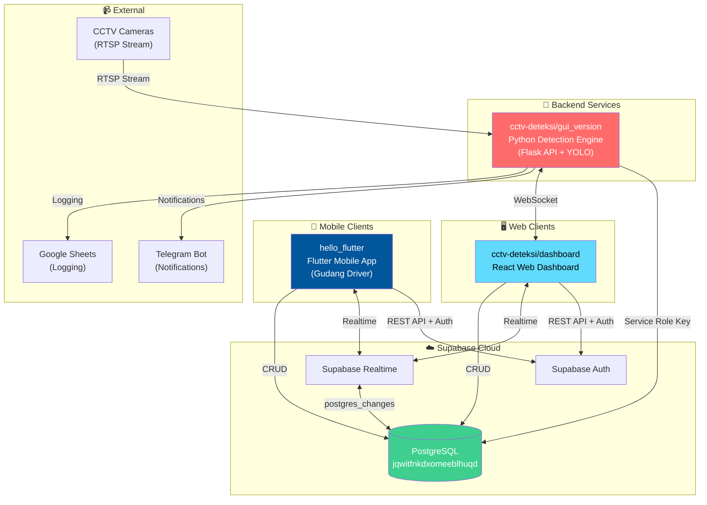
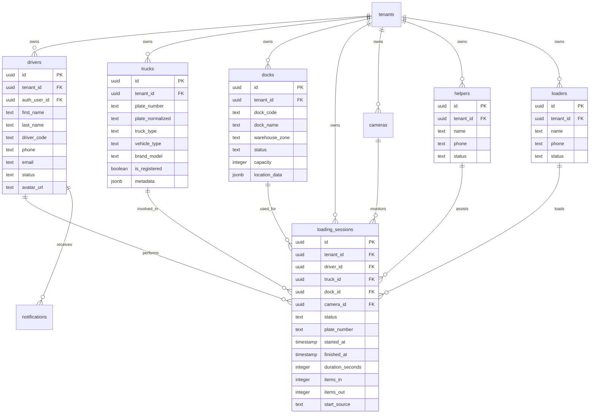
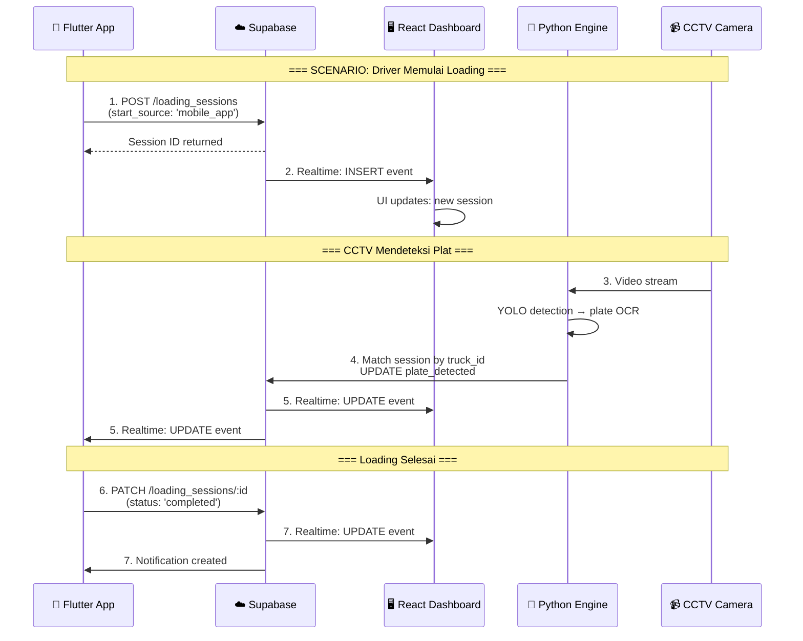
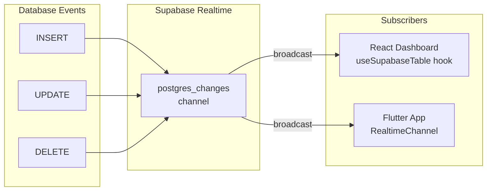

# Diagram Relasi: CCTV-Deteksi ↔ Hello Flutter (Gudang Driver)

## 1. Overview

Dua project ini **TERHUBUNG** melalui **database Supabase yang sama**:

| Project | Lokasi | Teknologi | Fungsi |
|---------|--------|-----------|--------|
| **cctv-deteksi** | `projects/cctv-deteksi/` | React + Python + Supabase | Dashboard monitoring + CCTV detection engine |
| **hello_flutter** | `projects/hello_flutter/` | Flutter + Supabase | Mobile app untuk driver |

**Shared Supabase Project:**
- **URL**: `https://jqwitfnkdxomeeblhuqd.supabase.co`
- **Project ID**: `jqwitfnkdxomeeblhuqd`

---

## 2. System Architecture Diagram



---

## 3. Shared Database Tables

Kedua project mengakses tabel yang sama di Supabase:



---

## 4. Data Flow Diagram

### 4.1 Loading Session Flow



### 4.2 Data Sync Direction

| Table | Flutter → DB | DB → Dashboard | Python → DB |
|-------|--------------|----------------|-------------|
| `drivers` | ✅ Create/Update profile | ✅ Read all | ❌ |
| `trucks` | ✅ Register vehicle | ✅ Read all | ✅ Upsert detected |
| `docks` | ❌ Read only | ✅ Read/Manage | ❌ |
| `loading_sessions` | ✅ Start/Complete | ✅ Read all | ✅ Update plate_detected |
| `helpers` | ❌ Read only | ✅ Read/Manage | ❌ |
| `loaders` | ❌ Read only | ✅ Read/Manage | ❌ |
| `notifications` | ✅ Read/Mark read | ❌ | ✅ Create alerts |

---

## 5. Component Diagram per Project

### 5.1 cctv-deteksi Structure

```
cctv-deteksi/
├── dashboard/                   # React Web Dashboard
│   ├── src/
│   │   ├── components/         # UI Components
│   │   ├── contexts/           # AuthContext (Supabase)
│   │   ├── hooks/              # useDrivers, useDocks, etc.
│   │   ├── lib/supabase.js     # Supabase client
│   │   └── pages/              # DriversPage, SessionsPage, etc.
│   └── .env                    # VITE_SUPABASE_URL, VITE_SUPABASE_ANON_KEY
│
├── gui_version_testing_with_server/  # Python Backend
│   ├── src/
│   │   ├── api/                # Flask API server
│   │   ├── detection/          # YOLO + plate detection
│   │   └── integrations/
│   │       ├── supabase/       # Supabase listener
│   │       └── telegram/       # Telegram bot
│   └── .env                    # SUPABASE_URL, SUPABASE_SERVICE_KEY
│
└── docs/                       # Documentation
```

### 5.2 hello_flutter Structure

```
hello_flutter/
├── lib/
│   ├── core/
│   │   └── config/
│   │       └── supabase_config.dart  # Same Supabase project!
│   ├── data/
│   │   ├── models/
│   │   │   ├── driver_model.dart     # Maps to `drivers` table
│   │   │   ├── truck_model.dart      # Maps to `trucks` table
│   │   │   ├── dock_model.dart       # Maps to `docks` table
│   │   │   ├── loading_session_model.dart
│   │   │   ├── helper_model.dart
│   │   │   └── loader_model.dart
│   │   └── services/
│   │       ├── auth_service.dart     # Supabase Auth
│   │       ├── driver_service.dart   # CRUD drivers
│   │       └── loading_service.dart  # CRUD sessions
│   └── features/
│       ├── auth/                     # Login/Signup screens
│       ├── home/                     # Dashboard
│       ├── loading/                  # Loading session screen
│       └── history/                  # Session history
│
├── mock-admin/                       # Simple HTML admin panel
├── plans/
│   └── DATABASE_SYNC_CCTV_FLUTTER_PLAN.md
└── pubspec.yaml                      # supabase_flutter: ^2.8.0
```

---

## 6. Integration Points

### 6.1 Supabase Configuration Comparison

| Config | cctv-deteksi/dashboard | hello_flutter |
|--------|------------------------|---------------|
| URL | `VITE_SUPABASE_URL` in `.env` | `SupabaseConfig.url` in dart |
| Anon Key | `VITE_SUPABASE_ANON_KEY` in `.env` | `SupabaseConfig.anonKey` in dart |
| Value | `https://jqwitfnkdxomeeblhuqd.supabase.co` | `https://jqwitfnkdxomeeblhuqd.supabase.co` |

**✅ CONFIRMED: Both use the SAME Supabase project!**

### 6.2 Shared Models Mapping

| Flutter Model | React Hook | Database Table |
|---------------|------------|----------------|
| `DriverModel` | `useDrivers()` | `drivers` |
| `TruckModel` | `useTrucks()` | `trucks` |
| `DockModel` | `useDocks()` | `docks` |
| `LoadingSessionModel` | `useSessions()` | `loading_sessions` |
| `HelperModel` | `useHelpers()` | `helpers` |
| `LoaderModel` | `useLoaders()` | `loaders` |
| `NotificationModel` | - | `notifications` |

---

## 7. Real-time Synchronization

Kedua project dapat menerima update real-time melalui **Supabase Realtime**:



**Example: When Flutter creates a session:**
1. Flutter: `supabase.from('loading_sessions').insert(...)`
2. Supabase: Stores data + broadcasts INSERT event
3. React Dashboard: Receives event → UI auto-updates (via `useSupabaseTable`)
4. Flutter App: Receives confirmation

---

## 8. Summary Diagram

```
┌─────────────────────────────────────────────────────────────────────────────┐
│                           UNIFIED WAREHOUSE SYSTEM                          │
├─────────────────────────────────────────────────────────────────────────────┤
│                                                                             │
│  ┌─────────────────────┐          ┌──────────────────────────────────────┐ │
│  │                     │          │                                      │ │
│  │   hello_flutter     │          │         cctv-deteksi                 │ │
│  │   (Mobile App)      │          │                                      │ │
│  │                     │          │  ┌────────────┐  ┌────────────────┐  │ │
│  │  • Driver login     │          │  │  Dashboard │  │ Python Engine  │  │ │
│  │  • Start loading    │          │  │  (React)   │  │ (Detection)    │  │ │
│  │  • View history     │          │  │            │  │                │  │ │
│  │  • Notifications    │          │  │  • Monitor │  │ • CCTV stream  │  │ │
│  │                     │          │  │  • Reports │  │ • Plate OCR    │  │ │
│  └──────────┬──────────┘          │  │  • Manage  │  │ • Alerts       │  │ │
│             │                     │  └─────┬──────┘  └───────┬────────┘  │ │
│             │                     │        │                 │           │ │
│             │                     └────────┼─────────────────┼───────────┘ │
│             │                              │                 │             │
│             └──────────────┬───────────────┘                 │             │
│                            │                                 │             │
│                            ▼                                 │             │
│              ┌─────────────────────────────┐                 │             │
│              │                             │◄────────────────┘             │
│              │       SUPABASE              │                               │
│              │  jqwitfnkdxomeeblhuqd       │                               │
│              │                             │                               │
│              │  • PostgreSQL (data)        │                               │
│              │  • Auth (users)             │                               │
│              │  • Realtime (sync)          │                               │
│              │  • Storage (files)          │                               │
│              │                             │                               │
│              └─────────────────────────────┘                               │
│                                                                             │
└─────────────────────────────────────────────────────────────────────────────┘
```

---

## 9. Key Findings

| Aspect | Finding |
|--------|---------|
| **Database** | ✅ Shared Supabase project (`jqwitfnkdxomeeblhuqd`) |
| **Auth** | ✅ Same Supabase Auth (drivers login via Flutter, admins via Dashboard) |
| **Real-time** | ✅ Both use Supabase Realtime for live updates |
| **Tables** | ✅ All tables accessible by both projects |
| **RLS** | ✅ Row Level Security enabled for tenant isolation |
| **Sync Design** | ✅ Documented in `hello_flutter/plans/DATABASE_SYNC_CCTV_FLUTTER_PLAN.md` |

---

_Document generated: 2026-02-03_
_Based on analysis of both project codebases_
