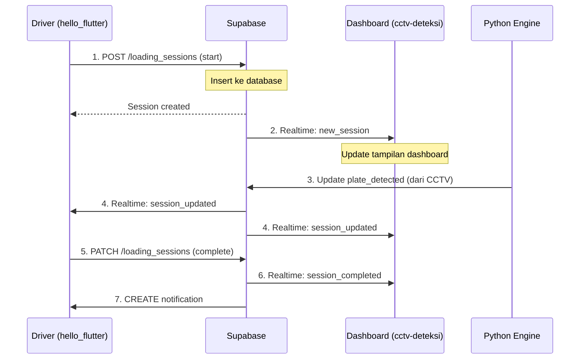

# Diagram Relasi: hello_flutter ↔ cctv-deteksi

> **Dokumen ini menjelaskan hubungan antara proyek `hello_flutter` dan `cctv-deteksi`**

---

## 1. Executive Summary

Kedua proyek ini adalah **bagian dari satu ekosistem** yang terintegrasi melalui **Supabase sebagai shared backend**:

| Aspek | hello_flutter | cctv-deteksi |
|-------|---------------|--------------|
| **Nama Aplikasi** | Gudang Driver | CCTV Monitoring Dashboard |
| **Platform** | Flutter (Mobile Android/iOS) | React (Web Dashboard) |
| **Pengguna** | Driver/Operator Gudang | Admin/Manager Gudang |
| **Fungsi Utama** | Loading operations dari mobile | Monitoring & Management |
| **Supabase URL** | `jqwitfnkdxomeeblhuqd.supabase.co` | `jqwitfnkdxomeeblhuqd.supabase.co` |

**Keduanya menggunakan database Supabase yang SAMA!**

---

## 2. Diagram Arsitektur Sistem

```
┌─────────────────────────────────────────────────────────────────────────────┐
│                         GUDANG DRIVER ECOSYSTEM                              │
│                                                                              │
│  ┌─────────────────┐                          ┌─────────────────────────┐   │
│  │                 │                          │                         │   │
│  │  hello_flutter  │                          │     cctv-deteksi        │   │
│  │  (Mobile App)   │                          │     (Web Dashboard)     │   │
│  │                 │                          │                         │   │
│  │  ┌───────────┐  │                          │  ┌─────────────────┐   │   │
│  │  │ Flutter   │  │                          │  │ React + Vite    │   │   │
│  │  │ (Dart)    │  │                          │  │ + TailwindCSS   │   │   │
│  │  └─────┬─────┘  │                          │  └────────┬────────┘   │   │
│  │        │        │                          │           │            │   │
│  │        │        │                          │           │            │   │
│  │ supabase_flutter│                          │ @supabase/supabase-js  │   │
│  │        │        │                          │           │            │   │
│  └────────┼────────┘                          └───────────┼────────────┘   │
│           │                                               │                 │
│           │              ┌──────────────┐                 │                 │
│           │              │              │                 │                 │
│           └──────────────►   SUPABASE   ◄─────────────────┘                 │
│                          │              │                                   │
│                          │ PostgreSQL   │                                   │
│                          │ + Auth       │                                   │
│                          │ + Realtime   │                                   │
│                          │ + Storage    │                                   │
│                          │              │                                   │
│                          └──────┬───────┘                                   │
│                                 │                                           │
│                                 │                                           │
│                    ┌────────────▼────────────┐                              │
│                    │                         │                              │
│                    │  gui_version_testing    │                              │
│                    │  (Python CCTV Engine)   │                              │
│                    │                         │                              │
│                    │  - Video Detection      │                              │
│                    │  - Plate Recognition    │                              │
│                    │  - Loading Events       │                              │
│                    │                         │                              │
│                    └─────────────────────────┘                              │
│                                                                              │
└─────────────────────────────────────────────────────────────────────────────┘

Project URL: https://jqwitfnkdxomeeblhuqd.supabase.co
```

---

## 3. Diagram Lokasi Folder

```
C:/Users/humblebreads/Documents/projects/
├── hello_flutter/              # 📱 Mobile App Flutter
│   ├── lib/
│   │   ├── core/
│   │   │   └── config/
│   │   │       └── supabase_config.dart  ⭐ Config Supabase
│   │   ├── data/
│   │   │   ├── models/                   # Data models
│   │   │   └── services/                 # API services
│   │   └── features/
│   │       ├── auth/                     # Login/Signup
│   │       ├── home/                     # Dashboard
│   │       ├── loading/                  # Loading operations
│   │       └── history/                  # Riwayat
│   └── plans/
│       └── DATABASE_SYNC_CCTV_FLUTTER_PLAN.md  ⭐ Desain integrasi
│
├── cctv-deteksi/               # 🖥️ Web Dashboard + Backend
│   ├── dashboard/              # React Dashboard
│   │   ├── src/
│   │   │   ├── lib/
│   │   │   │   └── supabase.js          ⭐ Config Supabase
│   │   │   ├── hooks/                   # Supabase hooks
│   │   │   ├── pages/                   # UI Pages
│   │   │   └── components/              # UI Components
│   │   └── supabase/
│   │       └── migrations/              # Database schema
│   │
│   ├── gui_version_testing_with_server/  # Python Backend
│   │   └── src/
│   │       ├── api/                     # REST API
│   │       ├── detection/               # Video detection
│   │       └── integrations/
│   │           └── supabase/            ⭐ Python Supabase
│   │
│   └── docs/                   # Documentation
│       └── DIAGRAM_RELASI_HELLO_FLUTTER_CCTV.md  (dokumen ini)
│
└── [folder lainnya...]
```

---

## 4. Diagram Alur Data (Data Flow)

### 4.1 Skenario: Driver Memulai Loading dari Mobile



### 4.2 Skenario: Admin Melihat Data Real-time

```
┌─────────────────┐     ┌──────────────┐     ┌─────────────────┐
│  hello_flutter  │     │   Supabase   │     │  cctv-deteksi   │
│   (Mobile)      │     │  (Database)  │     │  (Dashboard)    │
└────────┬────────┘     └──────┬───────┘     └────────┬────────┘
         │                     │                      │
         │ INSERT driver       │                      │
         ├────────────────────►│                      │
         │                     │ Realtime broadcast   │
         │                     ├─────────────────────►│
         │                     │                      │ Update UI
         │                     │                      │
         │ INSERT session      │                      │
         ├────────────────────►│                      │
         │                     │ Realtime broadcast   │
         │                     ├─────────────────────►│
         │                     │                      │ Show active
         │                     │                      │ session
         │                     │                      │
         │ UPDATE session      │                      │
         ├────────────────────►│                      │
         │                     │ Realtime broadcast   │
         │                     ├─────────────────────►│
         │                     │                      │ Update timer
         │                     │                      │
```

---

## 5. Diagram Database Schema (Shared)

```
┌──────────────────────────────────────────────────────────────────────────────┐
│                            SUPABASE DATABASE                                  │
│                     jqwitfnkdxomeeblhuqd.supabase.co                          │
├──────────────────────────────────────────────────────────────────────────────┤
│                                                                              │
│   ┌─────────────┐     ┌─────────────┐     ┌─────────────┐                   │
│   │   tenants   │────<│   drivers   │────<│   trucks    │                   │
│   │             │     │             │     │             │                   │
│   │ - id        │     │ - id        │     │ - id        │                   │
│   │ - name      │     │ - tenant_id │     │ - tenant_id │                   │
│   │ - settings  │     │ - name      │     │ - plate_num │                   │
│   └─────────────┘     │ - phone     │     └──────┬──────┘                   │
│          │            │ - status    │            │                          │
│          │            └──────┬──────┘            │                          │
│          │                   │                   │                          │
│          │            ┌──────▼──────────────────▼──────┐                    │
│          │            │       loading_sessions         │                    │
│          │            │                                │                    │
│          │            │ - id                           │                    │
│          └───────────>│ - tenant_id                    │                    │
│                       │ - driver_id                    │                    │
│                       │ - truck_id                     │                    │
│                       │ - dock_id                      │                    │
│                       │ - status                       │                    │
│                       │ - started_at                   │                    │
│                       │ - ended_at                     │                    │
│                       └───────────────┬────────────────┘                    │
│                                       │                                     │
│   ┌─────────────┐     ┌───────────────▼────────────────┐                   │
│   │    docks    │────<│       notifications            │                   │
│   │             │     │                                │                   │
│   │ - id        │     │ - id                           │                   │
│   │ - tenant_id │     │ - driver_id                    │                   │
│   │ - dock_code │     │ - type                         │                   │
│   │ - status    │     │ - title                        │                   │
│   └─────────────┘     │ - message                      │                   │
│                       │ - is_read                      │                   │
│   ┌─────────────┐     └────────────────────────────────┘                   │
│   │   cameras   │                                                          │
│   │             │     ┌────────────────────────────────┐                   │
│   │ - id        │     │          helpers               │                   │
│   │ - dock_id   │     │                                │                   │
│   │ - name      │     │ - id                           │                   │
│   │ - status    │     │ - tenant_id                    │                   │
│   └─────────────┘     │ - name                         │                   │
│                       │ - status                       │                   │
│                       └────────────────────────────────┘                   │
│                                                                              │
└──────────────────────────────────────────────────────────────────────────────┘
```

---

## 6. Tabel Perbandingan Fitur

| Fitur | hello_flutter | cctv-deteksi Dashboard | Shared via Supabase |
|-------|---------------|------------------------|---------------------|
| **Drivers** | Create, View own | View all, CRUD | ✅ `drivers` |
| **Trucks** | Select for session | View all, CRUD | ✅ `trucks` |
| **Docks** | View available | CRUD, status update | ✅ `docks` |
| **Sessions** | Start/Stop loading | Monitor, View history | ✅ `loading_sessions` |
| **Notifications** | Receive | Send broadcast | ✅ `notifications` |
| **Helpers** | - | View, CRUD | ✅ `helpers` |
| **Loaders** | - | View, CRUD | ✅ `loaders` |
| **Cameras** | - | View streams | ✅ `cameras` |
| **Auth** | Login/Signup | Login | ✅ Supabase Auth |
| **Realtime** | Dock status | All tables | ✅ Supabase Realtime |

---

## 7. Diagram Komponen Kode yang Sama

### 7.1 Supabase Config Comparison

**hello_flutter** - `lib/core/config/supabase_config.dart`:
```dart
static const String url = 'https://jqwitfnkdxomeeblhuqd.supabase.co';
static const String anonKey = 'eyJhbGci...';
```

**cctv-deteksi** - `dashboard/.env`:
```
VITE_SUPABASE_URL=https://jqwitfnkdxomeeblhuqd.supabase.co
VITE_SUPABASE_ANON_KEY=eyJhbGci...
```

**SAMA!** ✅

### 7.2 Model Classes Mapping

| hello_flutter (Dart) | cctv-deteksi (JS Hook) | Database Table |
|---------------------|------------------------|----------------|
| `DriverModel` | `useDrivers()` | `drivers` |
| `TruckModel` | `useTrucks()` | `trucks` |
| `DockModel` | `useDocks()` | `docks` |
| `LoadingSessionModel` | `useSessions()` | `loading_sessions` |
| `NotificationModel` | `useNotifications()` | `notifications` |
| `HelperModel` | `useHelpers()` | `helpers` |
| `LoaderModel` | `useLoaders()` | `loaders` |

---

## 8. Diagram Realtime Sync

```
┌────────────────────────────────────────────────────────────────┐
│                     SUPABASE REALTIME                          │
│                                                                │
│  Postgres Changes → Broadcast → All Connected Clients          │
│                                                                │
│  ┌──────────────────────────────────────────────────────────┐ │
│  │                                                          │ │
│  │   Table: loading_sessions                                │ │
│  │                                                          │ │
│  │   INSERT → [hello_flutter] ✓  [dashboard] ✓             │ │
│  │   UPDATE → [hello_flutter] ✓  [dashboard] ✓             │ │
│  │   DELETE → [hello_flutter] ✓  [dashboard] ✓             │ │
│  │                                                          │ │
│  └──────────────────────────────────────────────────────────┘ │
│                                                                │
│  ┌──────────────────────────────────────────────────────────┐ │
│  │                                                          │ │
│  │   Table: docks                                           │ │
│  │                                                          │ │
│  │   UPDATE → [hello_flutter] ✓  [dashboard] ✓             │ │
│  │                                                          │ │
│  └──────────────────────────────────────────────────────────┘ │
│                                                                │
│  ┌──────────────────────────────────────────────────────────┐ │
│  │                                                          │ │
│  │   Table: notifications                                   │ │
│  │                                                          │ │
│  │   INSERT → [hello_flutter] ✓  [dashboard] ✓             │ │
│  │                                                          │ │
│  └──────────────────────────────────────────────────────────┘ │
│                                                                │
└────────────────────────────────────────────────────────────────┘
```

---

## 9. Kesimpulan

### 9.1 Hubungan Utama

1. **Shared Database**: Kedua proyek menggunakan Supabase yang sama (`jqwitfnkdxomeeblhuqd.supabase.co`)

2. **Complementary Roles**:
   - `hello_flutter` = **Producer** (create sessions, update status)
   - `cctv-deteksi` = **Consumer + Admin** (monitor, manage, configure)

3. **Real-time Sync**: Perubahan di satu aplikasi langsung terlihat di aplikasi lain melalui Supabase Realtime

4. **Single Source of Truth**: Database Supabase adalah satu-satunya sumber data yang valid

### 9.2 Diagram Relasi Final

```
┌───────────────────────────────────────────────────────────────┐
│                                                               │
│                    GUDANG DRIVER SYSTEM                       │
│                                                               │
│    ┌───────────────┐         ┌───────────────┐               │
│    │               │         │               │               │
│    │ hello_flutter │◄───────►│ cctv-deteksi  │               │
│    │               │         │               │               │
│    │  📱 Mobile    │   VIA   │  🖥️ Dashboard  │               │
│    │  Driver App   │         │  Admin Panel  │               │
│    │               │         │               │               │
│    └───────┬───────┘         └───────┬───────┘               │
│            │                         │                        │
│            │    ┌───────────────┐    │                        │
│            │    │               │    │                        │
│            └───►│   SUPABASE    │◄───┘                        │
│                 │               │                             │
│                 │  PostgreSQL   │                             │
│                 │  + Auth       │                             │
│                 │  + Realtime   │◄─────┐                      │
│                 │               │      │                      │
│                 └───────────────┘      │                      │
│                                        │                      │
│                            ┌───────────┴───────────┐         │
│                            │                       │         │
│                            │    Python Engine      │         │
│                            │    (CCTV Detection)   │         │
│                            │                       │         │
│                            └───────────────────────┘         │
│                                                               │
└───────────────────────────────────────────────────────────────┘
```

---

## 10. File Referensi

### hello_flutter:
- [`lib/core/config/supabase_config.dart`](file:///C:/Users/humblebreads/Documents/projects/hello_flutter/lib/core/config/supabase_config.dart) - Supabase configuration
- [`lib/data/models/`](file:///C:/Users/humblebreads/Documents/projects/hello_flutter/lib/data/models/) - Data models
- [`lib/data/services/`](file:///C:/Users/humblebreads/Documents/projects/hello_flutter/lib/data/services/) - API services
- [`plans/003_SUPABASE_INTEGRATION_PLAN.md`](file:///C:/Users/humblebreads/Documents/projects/hello_flutter/plans/003_SUPABASE_INTEGRATION_PLAN.md) - Integration plan
- [`plans/DATABASE_SYNC_CCTV_FLUTTER_PLAN.md`](file:///C:/Users/humblebreads/Documents/projects/hello_flutter/plans/DATABASE_SYNC_CCTV_FLUTTER_PLAN.md) - Sync design

### cctv-deteksi:
- [`dashboard/src/lib/supabase.js`](dashboard/src/lib/supabase.js) - Supabase client
- [`dashboard/src/hooks/`](dashboard/src/hooks/) - Supabase React hooks
- [`dashboard/supabase/migrations/`](dashboard/supabase/migrations/) - Database schema
- [`gui_version_testing_with_server/src/integrations/supabase/`](gui_version_testing_with_server/src/integrations/supabase/) - Python integration

---

**Document Version:** 1.0  
**Created:** 2026-02-03  
**Author:** Backend Developer Agent
