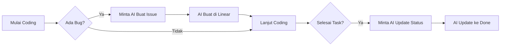

# Panduan Otomatisasi Linear dengan AI

> **TL;DR**: Ya, sangat mungkin! Linear sudah terintegrasi dengan AI melalui **MCP (Model Context Protocol)** dan saat ini sudah aktif di workspace kamu.

---

## Daftar Isi

1. [Apa Itu Linear + AI Automation?](#1-apa-itu-linear--ai-automation)
2. [Status Integrasi Saat Ini](#2-status-integrasi-saat-ini)
3. [Kemampuan yang Tersedia](#3-kemampuan-yang-tersedia)
4. [Cara Menggunakan](#4-cara-menggunakan)
5. [Contoh Penggunaan Praktis](#5-contoh-penggunaan-praktis)
6. [Opsi Automasi Lanjutan](#6-opsi-automasi-lanjutan)
7. [Best Practices](#7-best-practices)

---

## 1. Apa Itu Linear + AI Automation?

### Penjelasan Sederhana (ELI5)

Bayangkan kamu punya **asisten virtual** yang bisa:

- Membaca semua task/issue di Linear
- Membuat issue baru tanpa kamu buka Linear
- Update status issue otomatis
- Menambahkan komentar di issue
- Membuat project baru

Semua ini bisa dilakukan **langsung dari editor kode kamu** (VS Code, Cursor, dll) tanpa perlu buka browser ke Linear.

### Cara Kerjanya

```
┌─────────────┐     ┌──────────────┐     ┌─────────────┐
│   VS Code   │────▶│  MCP Server  │────▶│   Linear    │
│  (AI/Kamu)  │◀────│   (Bridge)   │◀────│  (Backend)  │
└─────────────┘     └──────────────┘     └─────────────┘
```

**MCP (Model Context Protocol)** = jembatan yang menghubungkan AI dengan Linear secara aman.

---

## 2. Status Integrasi Saat Ini

### ✅ Sudah Aktif!

Linear MCP sudah terkonfigurasi di workspace kamu:

| Komponen | Status | Detail |
|----------|--------|--------|
| Linear MCP Server | ✅ Aktif | `npx -y mcp-remote https://mcp.linear.app/mcp` |
| Team | ✅ Terkoneksi | "Testing-devs" (ID: `07114615-83a6-4f55-8c0b-12941b324fe3`) |
| Authentication | ✅ Valid | OAuth sudah terotentikasi |

### Lokasi Konfigurasi

```json
// Di MCP settings kamu
{
  "linear": {
    "command": "npx",
    "args": ["-y", "mcp-remote", "https://mcp.linear.app/mcp"]
  }
}
```

---

## 3. Kemampuan yang Tersedia

### 3.1 Manajemen Issue

| Aksi | Deskripsi | Contoh Perintah ke AI |
|------|-----------|----------------------|
| **Buat Issue** | Buat task baru | "Buatkan issue untuk bug login di team Testing-devs" |
| **Lihat Issue** | Baca detail issue | "Tampilkan semua issue yang assigned ke aku" |
| **Update Issue** | Ubah status/detail | "Update status issue ENG-123 ke Done" |
| **List Issues** | Lihat daftar issue | "Tampilkan semua issue di backlog" |

### 3.2 Manajemen Project

| Aksi | Deskripsi | Contoh Perintah ke AI |
|------|-----------|----------------------|
| **Buat Project** | Project baru | "Buat project Dashboard v2" |
| **Update Project** | Edit project | "Update milestone project X" |
| **List Projects** | Lihat semua project | "Tampilkan semua project aktif" |

### 3.3 Kolaborasi

| Aksi | Deskripsi | Contoh Perintah ke AI |
|------|-----------|----------------------|
| **Tambah Comment** | Komentar di issue | "Tambahkan komentar di issue ENG-123" |
| **List Comments** | Baca komentar | "Lihat semua komentar di issue ini" |
| **Buat Document** | Buat dokumen Linear | "Buat dokumen specs untuk fitur X" |

### 3.4 Query & Filtering

| Aksi | Deskripsi | Contoh Perintah ke AI |
|------|-----------|----------------------|
| **Search** | Cari issue | "Cari issue tentang authentication" |
| **Filter by Status** | Filter status | "Tampilkan semua issue In Progress" |
| **Filter by Assignee** | Filter assignee | "Lihat issue yang di-assign ke @john" |

---

## 4. Cara Menggunakan

### 4.1 Penggunaan Dasar (Via Chat AI)

Langsung bicara ke AI assistant di VS Code dengan bahasa natural:

```
Kamu: "Buatkan issue di Linear untuk bug: tombol submit tidak berfungsi di halaman login"

AI: [Membuat issue dengan title, description, dan labels yang sesuai]
```

### 4.2 Contoh Perintah Lengkap

#### Membuat Issue Baru

```
"Buatkan issue di team Testing-devs dengan:
- Title: Fix login button bug
- Description: Tombol login tidak respond saat diklik di Chrome
- Priority: High
- Labels: bug, frontend"
```

#### Melihat Issue yang Assigned ke Saya

```
"Tampilkan semua issue yang di-assign ke aku"
```

#### Update Status Issue

```
"Update issue TEST-123 ke status 'In Progress' dan assign ke aku"
```

#### Menambah Komentar

```
"Tambahkan komentar di TEST-123: 'Sudah mulai investigate, sepertinya masalah di event handler'"
```

---

## 5. Contoh Penggunaan Praktis

### 5.1 Workflow Development Sehari-hari



### 5.2 Skenario: Bug Ditemukan Saat Coding

**Situasi**: Kamu sedang coding dan menemukan bug.

**Langkah**:
1. Tetap di editor, tidak perlu buka browser
2. Chat ke AI: "Buatkan issue bug: API endpoint /users return 500 error saat data kosong, prioritas high"
3. AI otomatis membuat issue di Linear dengan detail lengkap
4. Lanjut coding

### 5.3 Skenario: Review Progress Harian

**Situasi**: Mau lihat apa yang harus dikerjakan hari ini.

**Langkah**:
1. Chat ke AI: "Tampilkan semua issue assigned ke aku yang masih In Progress atau Todo"
2. AI menampilkan daftar
3. Pilih issue dan mulai kerja

### 5.4 Skenario: Standup Meeting

**Situasi**: Perlu update untuk daily standup.

**Langkah**:
1. Chat ke AI: "Tampilkan issue yang aku selesaikan kemarin dan yang akan dikerjakan hari ini"
2. AI memberikan summary
3. Copy ke Slack/meeting notes

---

## 6. Opsi Automasi Lanjutan

### 6.1 Zapier Integration

Linear terintegrasi dengan **Zapier** untuk automasi yang lebih kompleks:

| Trigger | Action | Use Case |
|---------|--------|----------|
| Form submitted | Create Linear issue | User feedback → Issue |
| Email received | Create issue | Bug report email → Issue |
| Issue completed | Send Slack notification | Team notification |
| Issue created | Add to spreadsheet | Tracking & reporting |

**Setup**:
1. Buat akun Zapier
2. Koneksikan Linear
3. Buat "Zap" dengan trigger dan action yang diinginkan

### 6.2 GitHub Integration

Linear sudah terintegrasi dengan GitHub untuk:

- **Auto-link PR ke Issue**: Mention `TEST-123` di PR, otomatis terlink
- **Auto-update Status**: PR merged → Issue jadi "Done"
- **Branch Name Copy**: Copy branch name langsung dari Linear

**Setup**:
Linear → Settings → Integrations → GitHub → Connect

### 6.3 Custom API Integration

Untuk automasi custom, gunakan Linear API:

```python
# Contoh Python script untuk create issue
import requests

LINEAR_API_KEY = "your-api-key"
TEAM_ID = "07114615-83a6-4f55-8c0b-12941b324fe3"

def create_issue(title, description, priority=3):
    query = """
    mutation CreateIssue($input: IssueCreateInput!) {
        issueCreate(input: $input) {
            success
            issue { id identifier title }
        }
    }
    """
    
    variables = {
        "input": {
            "teamId": TEAM_ID,
            "title": title,
            "description": description,
            "priority": priority
        }
    }
    
    response = requests.post(
        "https://api.linear.app/graphql",
        headers={"Authorization": LINEAR_API_KEY},
        json={"query": query, "variables": variables}
    )
    
    return response.json()

# Usage
create_issue(
    "Bug: Login error", 
    "User tidak bisa login dengan email @gmail.com",
    priority=2  # High
)
```

### 6.4 Webhook untuk Real-time Updates

Linear bisa mengirim webhook ke sistem kamu:

```
Linear Issue Updated → Webhook → Your Server → Update Dashboard
```

**Use case untuk project kamu**:
- Issue "Done" → Update dashboard status
- New issue created → Kirim notifikasi ke Slack
- Priority changed → Re-prioritize in-app queue

---

## 7. Best Practices

### 7.1 Penamaan yang Konsisten

| Tipe | Format | Contoh |
|------|--------|--------|
| Bug | `Bug: [komponen] - [deskripsi singkat]` | `Bug: Login - Button tidak respond` |
| Feature | `Feat: [komponen] - [deskripsi]` | `Feat: Dashboard - Tambah filter tanggal` |
| Task | `Task: [deskripsi aksi]` | `Task: Setup CI/CD pipeline` |
| Docs | `Docs: [topik]` | `Docs: Update API documentation` |

### 7.2 Workflow yang Disarankan

```
Backlog → Todo → In Progress → In Review → Done
```

### 7.3 Gunakan Labels

Contoh labels yang berguna:

| Label | Penggunaan |
|-------|------------|
| `bug` | Issue adalah bug |
| `feature` | Issue adalah fitur baru |
| `frontend` | Terkait frontend |
| `backend` | Terkait backend |
| `urgent` | Perlu segera |
| `blocked` | Terblokir sesuatu |

### 7.4 Prioritas yang Jelas

| Level | Arti | Response Time |
|-------|------|---------------|
| **Urgent (1)** | Critical bug, sistem down | < 4 jam |
| **High (2)** | Bug major, blocking feature | < 1 hari |
| **Medium (3)** | Enhancement, minor bug | < 1 minggu |
| **Low (4)** | Nice to have, polish | Backlog |

---

## Kesimpulan

**Ya, kamu BISA mengotomatisasi Linear dengan AI!**

### Yang Sudah Aktif Sekarang:
- ✅ Linear MCP Server terkoneksi
- ✅ Bisa create/read/update issues via AI chat
- ✅ Bisa manage projects dan documents
- ✅ Bisa search dan filter issues

### Langkah Selanjutnya:
1. **Coba sekarang**: Minta AI "Tampilkan semua issue di team Testing-devs"
2. **Setup GitHub integration**: Untuk auto-link PR
3. **Pertimbangkan Zapier**: Untuk automasi lintas-app

---

## Referensi

- [Linear MCP Documentation](https://linear.app/docs/mcp)
- [Linear API Reference](https://developers.linear.app/docs)
- [Linear Zapier Integration](https://linear.app/docs/zapier)
- [Linear GitHub Integration](https://linear.app/docs/github)

---

*Dokumen ini dibuat: 2026-02-05*  
*Last updated: 2026-02-05*
