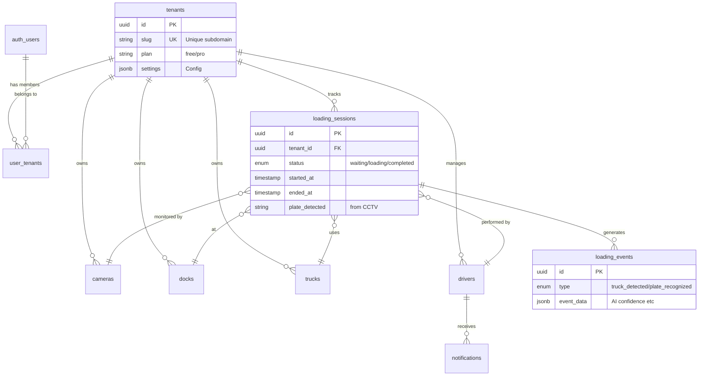

# Diagram Relasi: CCTV-Deteksi ↔ Hello Flutter ↔ Dashboard Database

## Executive Summary

Dokumen ini menggambarkan relasi arsitektur database secara mendalam antara:
1.  **Dashboard Database** (SaaS-Ready Schema di Supabase)
2.  **CCTV-Deteksi** (Backend Python & React Dashboard)
3.  **Hello Flutter** (Mobile App Driver)

**Konsep Utama**: Semua komponen menggunakan **Single Source of Truth** di Supabase, dengan skema **Multi-Tenant** yang mengisolasi data antar organisasi namun berbagi tabel master yang sama.

---

## 1. Skema Database Terpusat (Supabase)

Database ini dirancang dengan prinsip **Multi-Tenancy** sejak awal (SaaS-Ready), di mana setiap data penting terkait dengan `tenant_id`.



---

## 2. Mapping Data: Flutter App vs Dashboard DB

Tabel berikut menunjukkan bagaimana fitur di aplikasi Flutter memetakan langsung ke tabel di database Dashboard.

| Fitur Flutter | Tabel Database | Kolom Kunci | Keterangan |
| :--- | :--- | :--- | :--- |
| **Login / Auth** | `auth.users` | `id`, `email` | Menggunakan Supabase Auth (JWT). |
| **Profile Driver** | `public.drivers` | `auth_user_id`, `name`, `phone` | Data profil driver linked ke user auth. |
| **Pilih Truk** | `public.trucks` | `plate_number`, `vehicle_type` | Driver memilih dari daftar truk tenant. |
| **Mulai Loading** | `loading_sessions` | `status='loading'`, `started_at` | Insert row baru saat tombol "Start" ditekan. |
| **Selesai Loading** | `loading_sessions` | `status='completed'`, `ended_at` | Update row saat tombol "Finish" ditekan. |
| **History** | `loading_sessions` | `driver_id` filter | Query sesi yang lalu berdasarkan driver. |
| **Notifikasi** | `notifications` | `driver_id`, `is_read` | Menerima push notif/in-app alert. |

---

## 3. Mapping Data: CCTV Backend vs Dashboard DB

Bagaimana Python Backend (AI/Detection) berinteraksi dengan tabel yang sama.

| Proses Backend | Tabel Database | Aksi | Trigger |
| :--- | :--- | :--- | :--- |
| **Deteksi Truk** | `loading_events` | `INSERT` | Saat YOLO mendeteksi objek kelas 'truck'. |
| **Baca Plat** | `loading_sessions` | `UPDATE plate_detected` | Saat OCR berhasil membaca plat dengan confidence tinggi. |
| **Validasi Sesi** | `loading_sessions` | `SELECT` | Cek apakah ada sesi aktif untuk plat/dock tersebut. |
| **Stream Status** | `cameras` | `UPDATE status` | Ping status kamera (online/offline). |

---

## 4. Alur Sinkronisasi Data (Real-World Scenario)

Contoh skenario: **"Driver Datang, Loading, Lalu Pergi"**

### Fase 1: Inisiasi (Flutter)
1.  **Driver** buka app, pilih truk **B 1234 CD**.
2.  **App** insert ke `loading_sessions`:
    ```sql
    INSERT INTO loading_sessions (driver_id, truck_id, status, tenant_id)
    VALUES ('uuid-driver', 'uuid-truck-b1234cd', 'waiting', 'uuid-tenant');
    ```
3.  **Dashboard Website** menerima event Realtime (`INSERT`) dan menampilkan status "Waiting" di panel dock.

### Fase 2: Deteksi Kedatangan (CCTV Backend)
4.  **Truk** masuk ke dock. **CCTV** melihat truk.
5.  **Backend** insert event:
    ```sql
    INSERT INTO loading_events (session_id, event_type, description)
    VALUES ('uuid-session', 'truck_detected', 'Truck detected at Dock 1');
    ```
6.  **Backend** mengenali plat "B 1234 CD" -> Update sesi:
    ```sql
    UPDATE loading_sessions SET plate_detected = 'B 1234 CD', status = 'loading'
    WHERE id = 'uuid-session';
    ```
7.  **Flutter App** menerima update (`UPDATE`) -> Tampilan berubah jadi "Loading in Progress" (Verified by CCTV).

### Fase 3: Penyelesaian (Hybrid)
8.  **Loading** selesai.
9.  **Driver** tekan "Finish" di App **ATAU** **CCTV** melihat truk pergi.
10. **Database** diupdate:
    ```sql
    UPDATE loading_sessions SET status = 'completed', ended_at = NOW()
    WHERE id = 'uuid-session';
    ```
11. **Dashboard** memindahkan sesi ke "History/Completed Log".

---

## 5. Security & Isolation (RLS)

Karena database ini dipakai bersama (Shared), keamanan sangat krusial. **Row Level Security (RLS)** diaktifkan untuk memastikan:

1.  **Tenant Isolation**:
    *   Query `SELECT * FROM trucks` di Dashboard Tenant A **hanya** mengembalikan truk milik Tenant A.
    *   *Policy*: `tenant_id IN (SELECT get_user_tenant_ids())`

2.  **Driver Scope**:
    *   Driver hanya bisa mengedit sesi loading milik mereka sendiri (atau yang ditugaskan).
    *   Driver tidak bisa menghapus data master (Trucks/Cameras).

3.  **Backend Service**:
    *   Menggunakan `SERVICE_ROLE_KEY` (bypasses RLS) untuk tugas sistem otomatis (seperti update status kamera atau logging deteksi AI).

---

## 6. Diagram Integrasi Database

```
                                   ┌─────────────────────────┐
                                   │    SUPABASE (Postgres)  │
                                   │                         │
      ┌────────────────┐           │  ┌───────────────────┐  │           ┌─────────────────┐
      │ HELLO FLUTTER  │           │  │ TABLE: sessions   │  │           │  CCTV BACKEND   │
      │ (Mobile App)   │──────────►│  │ id, status,       │◄─────────────│ (Python/AI)     │
      │                │           │  │ plate_detected    │  │           │                 │
      └───────▲────────┘           │  └─────────▲─────────┘  │           └─────────────────┘
              │                    │            │            │
              │ (Realtime)         │            │ (Sync)     │
              │                    │            │            │
              │                    │  ┌─────────▼─────────┐  │
              └────────────────────┼──┤ TABLE: events     │  │
                                   │  │ truck_in,         │  │
                                   │  │ loading_start     │  │
                                   │  └─────────▲─────────┘  │
                                   │            │            │
                                   └────────────┼────────────┘
                                                │
                                                │ (Realtime)
                                                ▼
                                       ┌─────────────────┐
                                       │ DASHBOARD WEB   │
                                       │ (React/Admin)   │
                                       └─────────────────┘
```

---
*Dokumen ini melengkapi diagram arsitektur level tinggi dengan detail implementasi database spesifik.*
