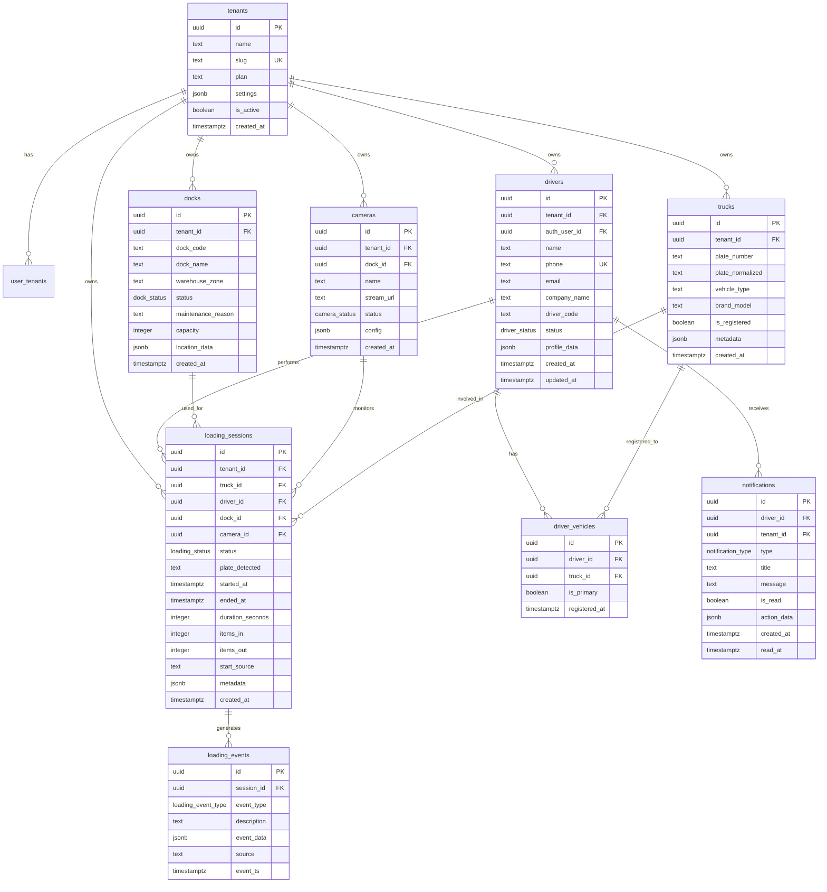
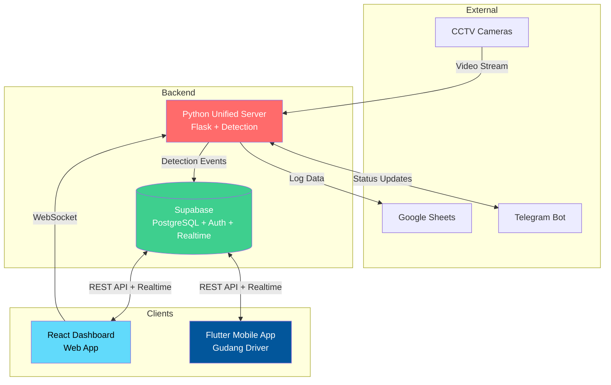
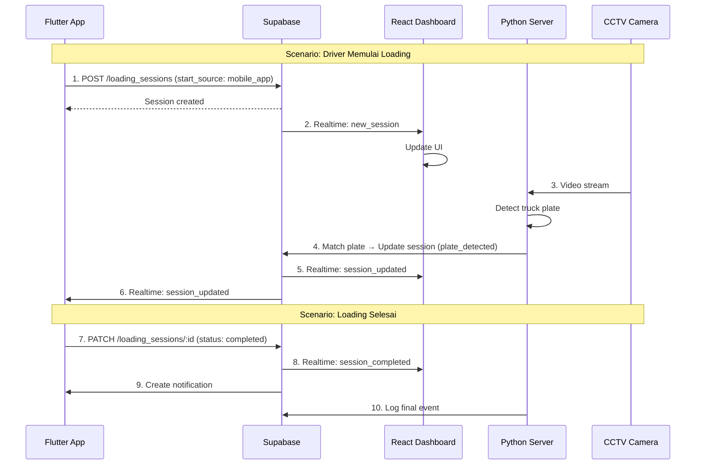

# Database Synchronization Plan: CCTV-Deteksi ↔ Hello Flutter

## Executive Summary

Dokumen ini menjelaskan desain database untuk sinkronisasi antara dua project:

1. **cctv-deteksi**: Sistem monitoring warehouse dengan CCTV dan deteksi kendaraan (React Dashboard + Python Backend + Supabase)
2. **hello_flutter**: Aplikasi mobile driver untuk loading validation (Flutter + akan connect ke Supabase yang sama)

**Tujuan**: Membuat skema database terpadu yang memungkinkan kedua sistem berbagi data secara real-time.

---

## 1. Analisis Project

### 1.1 CCTV-Deteksi (Dashboard + Backend)

| Komponen  | Teknologi                     | Fungsi                         |
| --------- | ----------------------------- | ------------------------------ |
| Dashboard | React + Vite + TailwindCSS    | UI monitoring real-time        |
| Backend   | Python Flask (unified_server) | Video streaming, detection API |
| Database  | Supabase (PostgreSQL)         | Penyimpanan data utama         |
| Real-time | WebSocket + Supabase Realtime | Live updates                   |
| Integrasi | Google Sheets, Telegram Bot   | Logging, notifications         |

**Existing Tables (dari migration)**:

- `tenants` - Multi-tenant support
- `user_tenants` - Relasi user-tenant dengan role
- `cameras` - CCTV cameras
- `trucks` - Kendaraan terdeteksi
- `loading_sessions` - Sesi loading/unloading
- `loading_events` - Event logs

### 1.2 Hello Flutter (Mobile App)

| Komponen      | Teknologi                       | Fungsi                  |
| ------------- | ------------------------------- | ----------------------- |
| Mobile App    | Flutter (Dart)                  | Driver mobile interface |
| Local Storage | Belum ada                       | Offline data            |
| Backend       | Belum ada (akan pakai Supabase) | API calls               |

**Current Data Models** (dari [`models.dart`](hello_flutter/lib/features/shared/data/models.dart)):

- `DriverInfo` - Nama, phone, plate, truckType, driverId
- `LoadingSession` - Sesi loading dengan detail waktu dan lokasi
- `HistoryItem` - Riwayat loading
- `DockStatus` - Status dock (available, loading, maintenance)
- `AppNotification` - Notifikasi in-app

---

## 2. Gap Analysis

### 2.1 Data yang Perlu Disinkronisasi

| Data Entity      | CCTV-Deteksi        | Hello Flutter          | Sync Direction     |
| ---------------- | ------------------- | ---------------------- | ------------------ |
| Drivers          | ❌ Belum ada        | ✅ DriverInfo          | Flutter → Supabase |
| Trucks/Vehicles  | ✅ trucks           | ✅ plate di DriverInfo | Bidirectional      |
| Loading Sessions | ✅ loading_sessions | ✅ LoadingSession      | Bidirectional      |
| Docks            | ❌ Belum ada        | ✅ DockStatus          | Supabase → Both    |
| Notifications    | ❌ Belum ada        | ✅ AppNotification     | Supabase → Flutter |
| Events/History   | ✅ loading_events   | ✅ HistoryItem         | Supabase → Flutter |

### 2.2 Missing Tables (Perlu Ditambahkan)

1. **`drivers`** - Data driver (missing di CCTV)
2. **`docks`** - Master data dock/loading bay
3. **`notifications`** - Notifikasi untuk mobile app
4. **`driver_vehicles`** - Relasi driver-vehicle (1 driver bisa punya banyak kendaraan)

---

## 3. Unified Database Schema Design

### 3.0 Key Design Principles: Flexibility

> **PENTING**: Driver dan Truck adalah relasi **fleksibel per session**, bukan fixed.

| Requirement                       | Desain                                                               |
| --------------------------------- | -------------------------------------------------------------------- |
| Driver bisa ganti truk kapan saja | `loading_sessions.truck_id` TIDAK harus ada di `driver_vehicles`     |
| Helper = Driver biasa             | Tidak ada pembedaan role, semua user tipe "driver/operator" setara   |
| Truk dipilih saat quick setup     | `truck_id` ditentukan saat create session, bukan hardcoded ke driver |
| 1 truk bisa dipakai banyak driver | `trucks` terpisah dari `drivers`, relasi via session                 |

#### 🔮 Future Extensibility: Operator Types

Jika nanti butuh membedakan **Driver vs Helper vs Loader**, desain ini mendukung dengan cara:

**Opsi A: Tambah field `operator_type`** (Recommended - paling simple)

```sql
ALTER TABLE drivers ADD COLUMN operator_type TEXT DEFAULT 'driver';
-- Values: 'driver', 'helper', 'loader'

-- Query per type
SELECT * FROM drivers WHERE operator_type = 'helper';
```

**Opsi B: Gunakan `profile_data` JSONB** (Tidak perlu alter table)

```sql
-- Update
UPDATE drivers SET profile_data = profile_data || '{"operator_type": "helper"}';

-- Query
SELECT * FROM drivers WHERE profile_data->>'operator_type' = 'loader';
```

**Opsi C: Tabel `operator_roles` terpisah** (Jika butuh permission berbeda per role)

```sql
CREATE TABLE operator_roles (
    id UUID PRIMARY KEY,
    name TEXT NOT NULL,        -- 'Driver', 'Helper', 'Loader'
    permissions JSONB          -- Jika butuh permission berbeda
);
ALTER TABLE drivers ADD COLUMN role_id UUID REFERENCES operator_roles(id);
```

---

### 3.1 Current Design: Simple Approach

> **PENTING**: Driver dan Truck adalah relasi **fleksibel per session**, bukan fixed.

| Requirement                       | Desain                                                               |
| --------------------------------- | -------------------------------------------------------------------- |
| Driver bisa ganti truk kapan saja | `loading_sessions.truck_id` TIDAK harus ada di `driver_vehicles`     |
| Helper = Driver biasa             | Tidak ada pembedaan role, semua user tipe "driver/operator" setara   |
| Truk dipilih saat quick setup     | `truck_id` ditentukan saat create session, bukan hardcoded ke driver |
| 1 truk bisa dipakai banyak driver | `trucks` terpisah dari `drivers`, relasi via session                 |

**Flow yang Didukung:**

```
┌─────────────────────────────────────────────────────────────────┐
│ LOGIN/QUICK SETUP                                               │
│ ┌─────────┐    ┌─────────────────┐    ┌──────────────────────┐ │
│ │ Driver  │───►│ Pilih/Input     │───►│ loading_sessions     │ │
│ │ Login   │    │ Plat Kendaraan  │    │ - driver_id = user   │ │
│ │         │    │ (any truck)     │    │ - truck_id = pilihan │ │
│ └─────────┘    └─────────────────┘    └──────────────────────┘ │
│                                                                 │
│ Session berikutnya → bisa pilih truk BERBEDA                    │
│ Helper login → sama seperti driver, pilih truk apapun           │
└─────────────────────────────────────────────────────────────────┘
```

**Catatan tentang `driver_vehicles` table:**

- Ini adalah **OPTIONAL** untuk menyimpan "truk favorit" atau "truk yang sering dipakai"
- TIDAK wajib diisi
- TIDAK membatasi pemilihan truk saat session
- Berguna untuk: autocomplete, history, statistik

### 3.1 Entity Relationship Diagram



### 3.2 New ENUMs Required

```sql
-- Driver status
CREATE TYPE driver_status AS ENUM (
    'pending_approval',  -- Menunggu approval admin
    'active',            -- Aktif
    'suspended',         -- Ditangguhkan
    'inactive'           -- Non-aktif
);

-- Dock status
CREATE TYPE dock_status AS ENUM (
    'available',         -- Tersedia
    'loading',           -- Sedang loading
    'unloading',         -- Sedang unloading
    'maintenance',       -- Dalam perbaikan
    'reserved',          -- Direservasi
    'closed'             -- Ditutup
);

-- Camera status
CREATE TYPE camera_status AS ENUM (
    'online',            -- Online dan aktif
    'offline',           -- Tidak aktif
    'maintenance',       -- Dalam perbaikan
    'error'              -- Error
);

-- Notification type
CREATE TYPE notification_type AS ENUM (
    'loading_started',   -- Loading dimulai
    'loading_completed', -- Loading selesai
    'dock_assigned',     -- Dock ditugaskan
    'system',            -- Notifikasi sistem
    'alert',             -- Alert/warning
    'info'               -- Informasi umum
);
```

---

## 4. Detailed Table Specifications

### 4.1 Table: `drivers`

Menyimpan data driver yang terdaftar dari mobile app.

```sql
CREATE TABLE IF NOT EXISTS drivers (
    id UUID PRIMARY KEY DEFAULT gen_random_uuid(),

    -- Tenant relationship
    tenant_id UUID NOT NULL REFERENCES tenants(id) ON DELETE CASCADE,

    -- Auth relationship (optional, jika driver punya akun Supabase Auth)
    auth_user_id UUID REFERENCES auth.users(id) ON DELETE SET NULL,

    -- Basic info
    name TEXT NOT NULL,
    phone TEXT NOT NULL,
    email TEXT,
    company_name TEXT,

    -- Driver identification
    driver_code TEXT, -- e.g., DRV-8821

    -- Status
    status driver_status DEFAULT 'pending_approval',

    -- Additional data (flexible)
    profile_data JSONB DEFAULT '{}'::jsonb,
    -- Example: {
    --   "photo_url": "...",
    --   "license_number": "...",
    --   "license_expiry": "..."
    -- }

    -- Timestamps
    created_at TIMESTAMPTZ DEFAULT NOW(),
    updated_at TIMESTAMPTZ DEFAULT NOW(),

    -- Constraints
    UNIQUE(tenant_id, phone)
);

-- Auto-generate driver_code
CREATE OR REPLACE FUNCTION generate_driver_code()
RETURNS TRIGGER AS $$
BEGIN
    IF NEW.driver_code IS NULL THEN
        NEW.driver_code := 'DRV-' || LPAD(
            (SELECT COALESCE(MAX(CAST(SUBSTRING(driver_code FROM 5) AS INTEGER)), 0) + 1
             FROM drivers WHERE tenant_id = NEW.tenant_id)::TEXT,
            4, '0'
        );
    END IF;
    RETURN NEW;
END;
$$ LANGUAGE plpgsql;

CREATE TRIGGER trigger_generate_driver_code
    BEFORE INSERT ON drivers
    FOR EACH ROW
    EXECUTE FUNCTION generate_driver_code();
```

### 4.2 Table: `docks`

Master data untuk loading bay/dock.

```sql
CREATE TABLE IF NOT EXISTS docks (
    id UUID PRIMARY KEY DEFAULT gen_random_uuid(),

    -- Tenant relationship
    tenant_id UUID NOT NULL REFERENCES tenants(id) ON DELETE CASCADE,

    -- Dock identification
    dock_code TEXT NOT NULL, -- e.g., A1, A2, B1
    dock_name TEXT, -- e.g., Dock A-12
    warehouse_zone TEXT, -- e.g., Zone A, Warehouse 1

    -- Status
    status dock_status DEFAULT 'available',
    maintenance_reason TEXT, -- Jika status = maintenance

    -- Capacity
    capacity INTEGER DEFAULT 1, -- Berapa truk bisa ditampung

    -- Location data (for future GPS/map integration)
    location_data JSONB DEFAULT '{}'::jsonb,
    -- Example: {
    --   "lat": -1.2345,
    --   "lng": 116.7890,
    --   "floor": 1
    -- }

    -- Timestamps
    created_at TIMESTAMPTZ DEFAULT NOW(),
    updated_at TIMESTAMPTZ DEFAULT NOW(),

    -- Constraints
    UNIQUE(tenant_id, dock_code)
);
```

### 4.3 Table: `driver_vehicles`

Relasi many-to-many antara driver dan kendaraan.

```sql
CREATE TABLE IF NOT EXISTS driver_vehicles (
    id UUID PRIMARY KEY DEFAULT gen_random_uuid(),

    -- Relationships
    driver_id UUID NOT NULL REFERENCES drivers(id) ON DELETE CASCADE,
    truck_id UUID NOT NULL REFERENCES trucks(id) ON DELETE CASCADE,

    -- Settings
    is_primary BOOLEAN DEFAULT false, -- Kendaraan utama driver

    -- Timestamps
    registered_at TIMESTAMPTZ DEFAULT NOW(),

    -- Constraints
    UNIQUE(driver_id, truck_id)
);

-- Ensure only one primary vehicle per driver
CREATE UNIQUE INDEX idx_driver_primary_vehicle
    ON driver_vehicles(driver_id)
    WHERE is_primary = true;
```

### 4.4 Table: `notifications`

Notifikasi untuk mobile app.

```sql
CREATE TABLE IF NOT EXISTS notifications (
    id UUID PRIMARY KEY DEFAULT gen_random_uuid(),

    -- Target
    driver_id UUID NOT NULL REFERENCES drivers(id) ON DELETE CASCADE,
    tenant_id UUID NOT NULL REFERENCES tenants(id) ON DELETE CASCADE,

    -- Content
    type notification_type NOT NULL,
    title TEXT NOT NULL,
    message TEXT NOT NULL,

    -- Status
    is_read BOOLEAN DEFAULT false,

    -- Action data (untuk deep link)
    action_data JSONB DEFAULT '{}'::jsonb,
    -- Example: {
    --   "action": "open_session",
    --   "session_id": "uuid-here"
    -- }

    -- Timestamps
    created_at TIMESTAMPTZ DEFAULT NOW(),
    read_at TIMESTAMPTZ,

    -- Index for quick lookup
    CONSTRAINT notifications_read_at_check
        CHECK (is_read = false OR read_at IS NOT NULL)
);
```

### 4.5 Modifications to Existing Tables

#### 4.5.1 Update `loading_sessions`

```sql
-- Add driver_id and dock_id columns
ALTER TABLE loading_sessions
    ADD COLUMN IF NOT EXISTS driver_id UUID REFERENCES drivers(id),
    ADD COLUMN IF NOT EXISTS dock_id UUID REFERENCES docks(id),
    ADD COLUMN IF NOT EXISTS duration_seconds INTEGER,
    ADD COLUMN IF NOT EXISTS items_in INTEGER DEFAULT 0,
    ADD COLUMN IF NOT EXISTS items_out INTEGER DEFAULT 0,
    ADD COLUMN IF NOT EXISTS start_source TEXT DEFAULT 'cctv'; -- 'cctv', 'mobile_app', 'manual'

-- Add indexes
CREATE INDEX IF NOT EXISTS idx_sessions_driver ON loading_sessions(driver_id);
CREATE INDEX IF NOT EXISTS idx_sessions_dock ON loading_sessions(dock_id);
```

#### 4.5.2 Update `cameras`

```sql
-- Add dock_id to link camera with dock
ALTER TABLE cameras
    ADD COLUMN IF NOT EXISTS dock_id UUID REFERENCES docks(id);

CREATE INDEX IF NOT EXISTS idx_cameras_dock ON cameras(dock_id);
```

---

## 5. Synchronization Architecture

### 5.1 System Context Diagram



### 5.2 Data Flow Diagram



### 5.3 Sync Strategies

| Scenario                 | Strategy           | Implementation                        |
| ------------------------ | ------------------ | ------------------------------------- |
| Driver registers         | Flutter → Supabase | Supabase Auth + drivers table insert  |
| Truck detected by CCTV   | Python → Supabase  | REST API call to upsert trucks        |
| Loading started from app | Flutter → Supabase | Real-time insert to loading_sessions  |
| Loading detected by CCTV | Python → Supabase  | Match plate, update or create session |
| Dock status change       | Supabase → Both    | Realtime subscription                 |
| Notifications            | Supabase → Flutter | Realtime + Push (FCM)                 |

---

## 6. API Endpoints for Synchronization

### 6.1 Driver APIs (Mobile App)

```yaml
# Authentication
POST   /auth/v1/signup        # Register driver
POST   /auth/v1/token         # Login
POST   /auth/v1/logout        # Logout
POST   /auth/v1/recover       # Forgot password

# Driver Profile
GET    /rest/v1/drivers?phone=eq.{phone}  # Get driver by phone
POST   /rest/v1/drivers                   # Create driver profile
PATCH  /rest/v1/drivers?id=eq.{id}        # Update profile

# Vehicles
GET    /rest/v1/driver_vehicles?driver_id=eq.{id}&select=*,trucks(*)
POST   /rest/v1/driver_vehicles           # Register vehicle
DELETE /rest/v1/driver_vehicles?id=eq.{id}

# Loading Sessions
GET    /rest/v1/loading_sessions?driver_id=eq.{id}&order=started_at.desc
POST   /rest/v1/loading_sessions          # Start loading
PATCH  /rest/v1/loading_sessions?id=eq.{id}  # Complete/cancel

# Docks
GET    /rest/v1/docks?tenant_id=eq.{id}&select=*,loading_sessions(status,driver:drivers(name))

# Notifications
GET    /rest/v1/notifications?driver_id=eq.{id}&is_read=eq.false
PATCH  /rest/v1/notifications?id=eq.{id}  # Mark as read
```

### 6.2 Python Backend APIs

```yaml
# Detection Events (internal)
POST   /api/detection/plate    # Report plate detection
POST   /api/detection/truck    # Report truck detection

# Sync with Supabase
POST   /api/sync/session       # Create/update loading session
GET    /api/sync/active        # Get active sessions for matching
```

### 6.3 Realtime Subscriptions

```javascript
// Dashboard subscription
supabase
  .channel("loading_sessions")
  .on(
    "postgres_changes",
    { event: "*", schema: "public", table: "loading_sessions" },
    (payload) => handleSessionChange(payload),
  )
  .subscribe();

// Mobile app subscription
supabase
  .channel("driver_notifications")
  .on(
    "postgres_changes",
    {
      event: "INSERT",
      schema: "public",
      table: "notifications",
      filter: `driver_id=eq.${driverId}`,
    },
    (payload) => showNotification(payload),
  )
  .subscribe();
```

---

## 7. Row Level Security (RLS) Policies

### 7.1 Drivers Table

```sql
-- Enable RLS
ALTER TABLE drivers ENABLE ROW LEVEL SECURITY;

-- Drivers can read their own profile
CREATE POLICY drivers_self_read ON drivers
    FOR SELECT USING (auth.uid() = auth_user_id);

-- Drivers can update their own profile
CREATE POLICY drivers_self_update ON drivers
    FOR UPDATE USING (auth.uid() = auth_user_id);

-- Admins can read all drivers in their tenant
CREATE POLICY drivers_admin_read ON drivers
    FOR SELECT USING (
        tenant_id IN (SELECT get_user_tenant_ids())
    );

-- Admins can manage drivers
CREATE POLICY drivers_admin_manage ON drivers
    FOR ALL USING (
        user_has_role(tenant_id, ARRAY['owner'::user_role, 'admin'::user_role])
    );
```

### 7.2 Notifications Table

```sql
ALTER TABLE notifications ENABLE ROW LEVEL SECURITY;

-- Drivers can only read their own notifications
CREATE POLICY notifications_self_read ON notifications
    FOR SELECT USING (
        driver_id IN (
            SELECT id FROM drivers WHERE auth_user_id = auth.uid()
        )
    );

-- Drivers can mark their own as read
CREATE POLICY notifications_self_update ON notifications
    FOR UPDATE USING (
        driver_id IN (
            SELECT id FROM drivers WHERE auth_user_id = auth.uid()
        )
    );
```

### 7.3 Docks Table

```sql
ALTER TABLE docks ENABLE ROW LEVEL SECURITY;

-- Anyone in tenant can read docks
CREATE POLICY docks_read ON docks
    FOR SELECT USING (
        tenant_id IN (SELECT get_user_tenant_ids())
    );

-- Only admins can manage docks
CREATE POLICY docks_manage ON docks
    FOR ALL USING (
        user_has_role(tenant_id, ARRAY['owner'::user_role, 'admin'::user_role])
    );
```

---

## 8. Migration Plan

### 8.1 Phase 1: Schema Updates (Database)

```
[ ] Create new ENUMs (driver_status, dock_status, camera_status, notification_type)
[ ] Create drivers table
[ ] Create docks table
[ ] Create driver_vehicles table
[ ] Create notifications table
[ ] Alter loading_sessions (add driver_id, dock_id, items_in, items_out, start_source)
[ ] Alter cameras (add dock_id)
[ ] Create indexes
[ ] Enable RLS and create policies
```

### 8.2 Phase 2: Seed Data

```
[ ] Insert sample docks for default tenant
[ ] Migrate existing truck data if needed
[ ] Create test driver accounts
```

### 8.3 Phase 3: Flutter Integration

```
[ ] Add supabase_flutter package
[ ] Implement authentication service
[ ] Create Supabase data models
[ ] Implement CRUD repositories
[ ] Setup realtime subscriptions
[ ] Update UI to use real data
```

### 8.4 Phase 4: Python Backend Updates

```
[ ] Add Supabase client library
[ ] Implement plate detection → session matching
[ ] Update event logging to use Supabase
[ ] Add driver lookup for detected plates
```

### 8.5 Phase 5: Dashboard Updates

```
[ ] Add driver management UI
[ ] Add dock management UI
[ ] Update session list to show driver info
[ ] Add dock status overview
```

---

## 9. Testing Checklist

### 9.1 Unit Tests

- [ ] Driver CRUD operations
- [ ] Vehicle registration
- [ ] Loading session lifecycle
- [ ] Notification creation

### 9.2 Integration Tests

- [ ] Mobile app login/register flow
- [ ] Start loading from mobile → appears on dashboard
- [ ] CCTV detection → matches with app session
- [ ] Realtime updates propagate correctly
- [ ] RLS policies enforce correctly

### 9.3 E2E Scenarios

- [ ] Driver registers → gets approved → can start loading
- [ ] Driver starts loading → CCTV detects plate → session updated
- [ ] Loading completes → driver gets notification → appears in history
- [ ] Admin views all sessions across drivers

---

## 10. Security Considerations

### 10.1 Authentication

- Mobile app uses Supabase Auth (email/phone + password)
- Dashboard uses same Supabase Auth
- Python backend uses service role key (server-side only)

### 10.2 Authorization

- RLS enforces tenant isolation
- Drivers can only see their own data
- Admins can see all data in their tenant
- Service role bypasses RLS for backend operations

### 10.3 Data Protection

- Phone numbers are unique per tenant
- Passwords are hashed by Supabase Auth
- Sensitive data (license photos) stored in private bucket

---

## 11. Observability

### 11.1 Logging

```
Component              | Log Location
-----------------------|-------------
Flutter App            | Console + Crashlytics
React Dashboard        | Browser console + Sentry
Python Backend         | stdout + structured JSON
Supabase               | Dashboard logs
```

### 11.2 Metrics to Track

- Active loading sessions count
- Session start latency (app → database)
- CCTV detection → session match rate
- Notification delivery rate
- API response times (p50, p95, p99)

### 11.3 Alerts

- Supabase database connection failures
- Python backend crashes
- High unmatched detection rate (>20%)
- Notification delivery failures

---

## 12. Appendix

### A. Full Migration SQL

Lihat file terpisah: [`002_sync_schema_migration.sql`](./002_sync_schema_migration.sql)

### B. Flutter Model Classes

```dart
// lib/features/shared/data/supabase_models.dart

class SupabaseDriver {
  final String id;
  final String tenantId;
  final String? authUserId;
  final String name;
  final String phone;
  final String? email;
  final String? companyName;
  final String? driverCode;
  final String status;
  final Map<String, dynamic> profileData;
  final DateTime createdAt;
  final DateTime updatedAt;

  // fromJson, toJson, copyWith...
}

class SupabaseDock {
  final String id;
  final String tenantId;
  final String dockCode;
  final String? dockName;
  final String? warehouseZone;
  final String status;
  final String? maintenanceReason;
  final int capacity;
  final Map<String, dynamic> locationData;
  final DateTime createdAt;

  // fromJson, toJson...
}

class SupabaseLoadingSession {
  final String id;
  final String tenantId;
  final String? truckId;
  final String? driverId;
  final String? dockId;
  final String? cameraId;
  final String status;
  final String? plateDetected;
  final DateTime? startedAt;
  final DateTime? endedAt;
  final int? durationSeconds;
  final int itemsIn;
  final int itemsOut;
  final String startSource;
  final Map<String, dynamic> metadata;
  final DateTime createdAt;

  // Computed properties
  Duration? get duration => durationSeconds != null
      ? Duration(seconds: durationSeconds!)
      : null;

  // fromJson, toJson...
}

class SupabaseNotification {
  final String id;
  final String driverId;
  final String tenantId;
  final String type;
  final String title;
  final String message;
  final bool isRead;
  final Map<String, dynamic> actionData;
  final DateTime createdAt;
  final DateTime? readAt;

  // fromJson, toJson...
}
```

### C. Python Supabase Client Example

```python
# src/integrations/supabase/client.py

from supabase import create_client, Client
import os

class SupabaseSync:
    def __init__(self):
        url = os.environ.get("SUPABASE_URL")
        key = os.environ.get("SUPABASE_SERVICE_KEY")  # Service role key
        self.client: Client = create_client(url, key)

    def upsert_truck(self, plate: str, tenant_id: str) -> dict:
        """Upsert truck when detected by CCTV."""
        normalized = self._normalize_plate(plate)
        return self.client.table("trucks").upsert({
            "tenant_id": tenant_id,
            "plate_number": plate,
            "plate_normalized": normalized,
            "is_registered": False
        }, on_conflict="plate_normalized,tenant_id").execute()

    def match_session(self, plate: str, tenant_id: str) -> dict | None:
        """Find active session matching detected plate."""
        result = self.client.table("loading_sessions").select(
            "*"
        ).eq(
            "tenant_id", tenant_id
        ).eq(
            "status", "loading"
        ).is_(
            "plate_detected", "null"
        ).execute()

        # Match by truck's plate
        for session in result.data:
            truck = self.client.table("trucks").select(
                "plate_normalized"
            ).eq("id", session["truck_id"]).single().execute()

            if truck.data and truck.data["plate_normalized"] == self._normalize_plate(plate):
                return session

        return None

    def update_session_plate(self, session_id: str, plate: str):
        """Update session with detected plate."""
        return self.client.table("loading_sessions").update({
            "plate_detected": plate
        }).eq("id", session_id).execute()

    def log_event(self, session_id: str, event_type: str, data: dict):
        """Log detection event."""
        return self.client.table("loading_events").insert({
            "session_id": session_id,
            "event_type": event_type,
            "event_data": data,
            "source": "cctv_detection"
        }).execute()

    def _normalize_plate(self, plate: str) -> str:
        """Normalize plate number for matching."""
        return plate.upper().replace(" ", "").replace("-", "")
```

---

## 13. Decision Log

| Decision                                | Rationale                                            | Date       |
| --------------------------------------- | ---------------------------------------------------- | ---------- |
| Use Supabase as single source of truth  | Simplifies sync, built-in realtime, RLS for security | 2026-01-24 |
| Multi-tenant from day one               | Already implemented in CCTV schema, future-proof     | 2026-01-24 |
| Driver → Vehicle as separate join table | One driver can have multiple vehicles                | 2026-01-24 |
| Dock as separate entity                 | Enables dock management, scheduling, status tracking | 2026-01-24 |
| Use start_source field                  | Track where session originated (mobile/cctv/manual)  | 2026-01-24 |

---

## 14. Risks and Mitigations

| Risk                     | Impact                       | Mitigation                                    |
| ------------------------ | ---------------------------- | --------------------------------------------- |
| Plate detection mismatch | Session not linked to driver | Manual matching UI, fuzzy matching algorithm  |
| Offline mobile app       | Driver can't start session   | Local queue, sync when online                 |
| Supabase downtime        | Both apps affected           | Local caching, graceful degradation           |
| RLS misconfiguration     | Data leakage                 | Comprehensive policy testing, security review |
| High concurrent sessions | Performance issues           | Connection pooling, indexes, read replicas    |

---

_Document Version: 1.0_  
_Created: 2026-01-24_  
_Author: Software Architect Agent_
