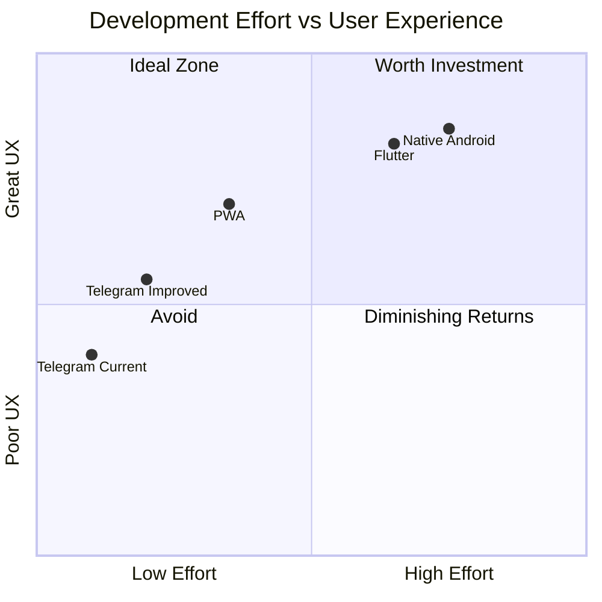
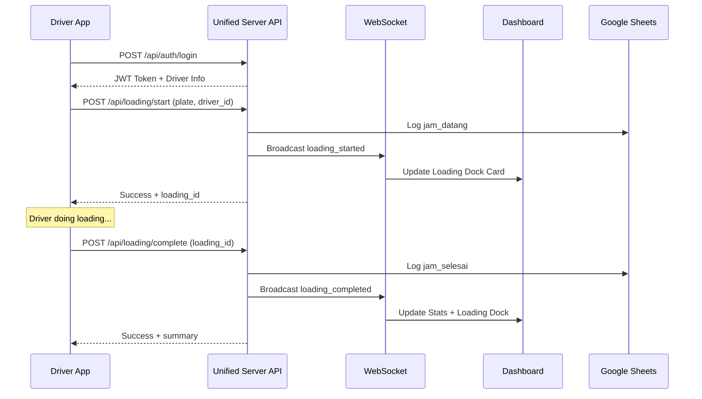

# 📱 Design Prompt: Driver Android App for Loading Validation

## 📋 Executive Summary

This document provides a design prompt and architecture recommendations for a **Driver Android App** to replace QR scan and Telegram-based loading validation in the Icetube Warehouse CCTV monitoring system.

---

## 🏗️ Architecture Opinion: Should You Use Android App?

### ✅ RECOMMENDATION: YES, with PWA as Alternative

| Aspect                    | Native Android                  | PWA (Progressive Web App)  | Telegram Bot (Current)    |
| ------------------------- | ------------------------------- | -------------------------- | ------------------------- |
| **Offline Support**       | ✅ Excellent                    | ⚠️ Limited                 | ❌ Requires internet      |
| **Push Notifications**    | ✅ Reliable                     | ⚠️ Inconsistent on Android | ✅ Built-in               |
| **Camera/QR Access**      | ✅ Full control                 | ⚠️ Limited                 | ❌ Not possible           |
| **Installation Friction** | ⚠️ Requires Play Store/APK      | ✅ Just a URL              | ✅ Already using Telegram |
| **Development Cost**      | ⚠️ Higher (Kotlin/Java/Flutter) | ✅ Lower (reuse React)     | ✅ Existing               |
| **Update Distribution**   | ⚠️ Store review delays          | ✅ Instant                 | ✅ Instant                |
| **Device Compatibility**  | ⚠️ Android only                 | ✅ Any browser             | ✅ Any device             |
| **Security/Auth**         | ✅ Full control                 | ✅ Full control            | ⚠️ Telegram auth          |
| **Professionalism**       | ✅ Dedicated app feel           | ⚠️ Web app feel            | ⚠️ Chat-based             |

### 🎯 My Recommendation

**Option A: React Native / Flutter App (Best for Drivers)**

- Native feel, offline capability, reliable push notifications
- More professional UX for dedicated driver workflow
- Can integrate device features (GPS, camera for future QR backup)
- Justifiable if you have 50+ regular drivers

**Option B: PWA First (Best for Cost/Speed)**

- Fastest to build (reuse existing React + TailwindCSS stack)
- Same codebase as web dashboard
- Install to home screen, works offline with service worker
- Upgrade to native later if needed
- **Recommended if you want quick deployment**

**Option C: Keep Telegram + Improve (Simplest)**

- Add inline keyboard buttons for smoother UX
- Implement QR scanning via Telegram camera bot
- Lowest friction for existing users
- But limited professionalism and control

### Trade-offs Analysis



---

## 🎨 DESIGN PROMPT FOR UI/UX

Copy the prompt below to request designs from AI tools (v0, Galileo AI, Figma AI, etc.):

---

```
Design a complete  Android mobile application for truck drivers to manage loading operations at a warehouse. The app is called "Gudang Driver" and replaces QR scanning/Telegram for loading validation.

---

## 📱 PROJECT CONTEXT

**App Name:** Gudang Driver (Warehouse Driver)
**Platform:** Android (Material Design 3 / Material You)
**Target Users:** Truck drivers arriving at warehouse for loading/unloading
**Language:** Indonesian (Bahasa Indonesia) with option for English

**Core User Flow:**
1. Driver arrives at warehouse
2. Opens app → Already logged in (persistent session)
3. Sees their assigned plate or selects from list
4. Taps "Mulai Loading" (Start Loading)
5. System validates with backend → Warehouse dashboard shows active loading
6. When done, driver taps "Selesai Loading" (Complete Loading)
7. Transaction logged automatically

**Integration:**
- Backend: REST API at `https://api.foodiserver.my.id`
- Real-time updates via WebSocket
- Google Sheets logging (automatic)
- Dashboard notified in real-time

---

## 🎨 DESIGN SYSTEM (Material Design 3)

### Color Scheme (Matching Web Dashboard)
- **Primary:** Lime-500 `#84cc16` (main brand color)
- **Secondary:** Emerald-500 `#10b981` (success/loading)
- **Error:** Rose-500 `#f43f5e` (alerts/errors)
- **Surface:** Gray-50 `#f9fafb` (backgrounds)
- **On Surface:** Gray-900 `#111827` (text)
- **Outline:** Gray-300 `#d1d5db` (borders)

### Typography (Roboto/Inter)
- **Display Large:** 57sp - Splash screen title
- **Headline Large:** 32sp - Page titles
- **Title Large:** 22sp - Card titles
- **Body Large:** 16sp - Primary text
- **Label Large:** 14sp - Buttons, inputs

### Components
- Material 3 buttons with rounded corners (28dp radius)
- Elevated cards with 4dp elevation
- Bottom navigation (if needed) or single-screen focus
- FAB for primary action (Start Loading)
- Snackbars for feedback
- Pull-to-refresh for data sync

### Icons
- Material Symbols (Outlined style)
- Key icons: truck, play_arrow, stop, check_circle, logout, settings, history

---

## 📄 SCREEN REQUIREMENTS

### 1. SPLASH SCREEN
**Duration:** 2-3 seconds (check auth state)

**Elements:**
- Centered app logo (truck + warehouse icon mashup)
- App name "Gudang Driver" in Display Large
- Lime-500 background or gradient (lime-500 to lime-600)
- Subtle loading indicator (circular progress)
- Company tagline: "Sistem Loading Digital"

**Behavior:**
- If logged in → Navigate to Home
- If not logged in → Navigate to Login

---

### 2. LOGIN PAGE
**Purpose:** Authenticate drivers securely

**Header:**
- Back arrow (for returning from signup)
- Logo smaller version

**Form Elements:**
- Headline: "Masuk ke Akun Anda" (Login to Your Account)
- Subtext: "Gunakan nomor HP atau email yang terdaftar"

- **Phone Number / Email Field:**
  - Material 3 OutlinedTextField
  - Prefix: +62 (for phone) or auto-detect email
  - Helper text: "Nomor HP atau email"

- **Password Field:**
  - Password visibility toggle
  - Helper text: "Minimal 6 karakter"

- **Remember Me Checkbox:** "Ingat saya"

- **Login Button:**
  - FilledButton, full width
  - Text: "MASUK"
  - Lime-500 background

- **Forgot Password Link:**
  - "Lupa kata sandi?"
  - Navigates to Forgot Password screen

**Footer:**
- "Belum punya akun? **Daftar**" (link to Sign Up)
- Optional: Company contact for registration help

**Validation:**
- Show inline errors below fields
- Disable button until valid input
- Show loading state on submit

---

### 3. SIGN UP PAGE
**Purpose:** Register new drivers (may require approval)

**Header:**
- Back arrow
- Logo

**Form Elements:**
- Headline: "Daftar Akun Baru" (Create New Account)

- **Nama Lengkap (Full Name):** Text field
- **Nomor HP (Phone Number):** With +62 prefix, validated format
- **Email:** Optional field
- **Nama Perusahaan (Company Name):** Optional, dropdown or text
- **Plat Kendaraan Utama (Primary Vehicle Plate):** "KT 1234 ABC" format
- **Password:** With strength indicator
- **Konfirmasi Password:** Must match

- **Terms Checkbox:**
  - "Saya setuju dengan **Syarat & Ketentuan** dan **Kebijakan Privasi**"

- **Register Button:**
  - "DAFTAR SEKARANG"
  - Lime-500 background

**After Submit:**
- Success dialog: "Pendaftaran berhasil! Tunggu konfirmasi admin."
- Or auto-login if no approval needed

**Footer:**
- "Sudah punya akun? **Masuk**"

---

### 4. FORGOT PASSWORD PAGE
**Purpose:** Reset password via SMS/Email

**Layout:** Single card, centered

**Elements:**
- Back arrow
- Lock icon illustration (80dp)
- Headline: "Reset Kata Sandi"
- Subtext: "Masukkan nomor HP untuk menerima kode OTP"

- **Phone/Email Field**
- **Send OTP Button:** "KIRIM KODE"

**OTP Verification State:**
- 6-digit OTP input (individual boxes)
- Countdown timer: "Kirim ulang dalam 00:59"
- "Kirim Ulang Kode" button after timer

**New Password State:**
- New password field
- Confirm password field
- "SIMPAN" button

**Success State:**
- Check icon
- "Kata sandi berhasil diubah!"
- "MASUK SEKARANG" button

---

### 5. HOME PAGE (Main Dashboard)
**Purpose:** Show current loading status and primary actions

**Top App Bar:**
- Left: Hamburger menu (open drawer) or profile avatar
- Center: "Gudang Driver"
- Right: Notification bell, Settings gear

**Main Content:**

**A. Driver Info Card (Top)**
```

┌─────────────────────────────────────┐
│ 👤 Nama Driver │
│ 📱 +62 812 3456 7890 │
│ 🚛 KT 9900 PQ HINO (Plat Terdaftar) │
│ 🏢 PT. Logistik Indonesia │
└─────────────────────────────────────┘

```

**B. Current Loading Status Card (Hero)**
Two states:

**State: IDLE (No Active Loading)**
```

┌─────────────────────────────────────┐
│ [🚛 Truck Icon] │
│ │
│ TIDAK ADA LOADING AKTIF │
│ Tap tombol untuk memulai │
│ │
│ ┌─────────────────────────┐ │
│ │ 🟢 MULAI LOADING │ │
│ └─────────────────────────┘ │
└─────────────────────────────────────┘

```

**State: LOADING (Active)**
```

┌─────────────────────────────────────┐
│ [🟢 Pulsing Icon] │
│ │
│ SEDANG LOADING │
│ KT 9900 PQ HINO │
│ ⏱️ 00:45:32 (elapsed time) │
│ 📍 Dock A - Loading Bay 1 │
│ │
│ ┌─────────────────────────┐ │
│ │ 🔴 SELESAI LOADING │ │
│ └─────────────────────────┘ │
└─────────────────────────────────────┘

```

**C. Quick Actions Row**
- Horizontal chips/buttons:
  - 📜 Riwayat Loading
  - 📞 Hubungi Operator
  - ❓ Bantuan

**D. Recent Activity Section**
- Last 3-5 loading transactions
- Each item: Date, Plate, Duration, Status badge (Selesai/Batal)

---

### 6. SIDE DRAWER / MENU
**Trigger:** Hamburger icon or swipe from left

**Content:**
- **Header:** Driver photo, name, phone, company
- **Menu Items:**
  - 🏠 Beranda (Home)
  - 🚛 Kendaraan Saya (My Vehicles - manage plates)
  - 📜 Riwayat Loading (Loading History)
  - 📊 Statistik (Statistics - optional)
  - ⚙️ Pengaturan (Settings)
  - ❓ Bantuan & FAQ
  - 🚪 Keluar (Logout)

---

### 7. VEHICLE MANAGEMENT PAGE
**Purpose:** Manage registered vehicle plates

**List of Vehicles:**
- Card for each vehicle
- Plate number, vehicle type, status (Active/Inactive)
- Set as primary toggle

**Add Vehicle FAB:**
- Opens bottom sheet
- Input: Plat Kendaraan, Jenis Kendaraan (dropdown: Truk, Pickup, dll)
- Optional: Photo of STNK for verification

---

### 8. LOADING HISTORY PAGE
**Purpose:** View past loading transactions

**Filter Bar:**
- Date range picker
- Status filter: Semua, Selesai, Dibatalkan

**List Items:**
- Date/time
- Plate number
- Warehouse name
- Duration
- Status badge

**Detail on Tap:**
- Full details: times, operator name, items count, notes

---

### 9. SETTINGS PAGE
**Purpose:** App preferences

**Sections:**
- **Akun (Account)**
  - Edit profile
  - Change password
  - Linked phone/email

- **Notifikasi (Notifications)**
  - Push notification toggle
  - Sound toggle

- **Bahasa (Language)**
  - Indonesia / English

- **Tentang Aplikasi (About)**
  - Version info
  - Privacy policy
  - Terms of service

---

## 🔔 NOTIFICATION STATES

**Push Notifications:**
1. "Loading dimulai untuk KT 9900 PQ" - When operator approves
2. "Loading selesai. Durasi: 45 menit" - Completion
3. "Pengingat: Anda belum memulai loading" - If at warehouse for 10+ mins

---

## 🎭 CONFIRMATION DIALOGS

**Start Loading Confirmation:**
```

┌─────────────────────────────────────┐
│ MULAI LOADING? │
│ │
│ Anda akan memulai loading untuk: │
│ 🚛 KT 9900 PQ HINO │
│ 📍 Warehouse Icetube │
│ │
│ ┌───────────┐ ┌───────────┐ │
│ │ BATAL │ │ YA │ │
│ └───────────┘ └───────────┘ │
└─────────────────────────────────────┘

```

**Complete Loading Confirmation:**
```

┌─────────────────────────────────────┐
│ SELESAI LOADING? │
│ │
│ Durasi: 00:45:32 │
│ Plat: KT 9900 PQ HINO │
│ │
│ ┌───────────┐ ┌───────────┐ │
│ │ BATAL │ │ SELESAI │ │
│ └───────────┘ └───────────┘ │
└─────────────────────────────────────┘

```

---

## 📱 RESPONSIVE & ACCESSIBILITY

- **Min SDK:** Android 7.0 (API 24)
- **Target SDK:** Android 14 (API 34)
- **Screen Sizes:** Support phones 5" to 7"
- **Dark Mode:** Optional, follow system setting
- **Accessibility:**
  - Minimum 48dp touch targets
  - Content descriptions for icons
  - Support TalkBack

---

## 🔒 SECURITY REQUIREMENTS

- Biometric login option (fingerprint/face)
- Auto-logout after 24 hours inactive
- Session token stored in EncryptedSharedPreferences
- Certificate pinning for API calls
- No sensitive data in logs

---

## 🚀 ANIMATIONS & TRANSITIONS

- Shared element transition between screens
- Ripple effect on buttons
- Pulsing animation for active loading indicator
- Slide-in for bottom sheets
- Fade for dialogs

---

## 📐 WIREFRAME FLOW

```

┌─────────┐ ┌─────────┐ ┌─────────┐
│ Splash │────▶│ Login │────▶│ Home │
└─────────┘ └─────────┘ └─────────┘
│ │
▼ ▼
┌─────────┐ ┌─────────┐
│ Sign Up │ │ Menu │
└─────────┘ └─────────┘
│ │
▼ ▼
┌─────────┐ ┌─────────┐
│ Forgot │ │ History │
│Password │ │ Settings│
└─────────┘ └─────────┘

```

---

## ✅ DELIVERABLES

1. High-fidelity mockups for all screens (Figma/Sketch)
2. Interactive prototype showing key flows
3. Icon and illustration assets
4. Component specifications
5. Animation specifications
6. Design tokens (colors, typography, spacing)

---

## 🚫 AVOID

- iOS-style design patterns (use Material Design 3)
- Too many features on home screen (focus on core action)
- Complex navigation (max 2 taps to any feature)
- Tiny text or buttons (drivers may use phone with one hand)
- Excessive required fields in forms
```

---

## 📊 Data Flow Architecture



---

## 🔧 API Endpoints Needed (New)

| Method | Endpoint                      | Description                |
| ------ | ----------------------------- | -------------------------- |
| POST   | `/api/driver/login`           | Driver authentication      |
| POST   | `/api/driver/register`        | New driver registration    |
| POST   | `/api/driver/forgot-password` | Request password reset     |
| POST   | `/api/driver/reset-password`  | Set new password           |
| GET    | `/api/driver/profile`         | Get driver profile         |
| PUT    | `/api/driver/profile`         | Update driver profile      |
| GET    | `/api/driver/vehicles`        | List driver's vehicles     |
| POST   | `/api/driver/vehicles`        | Add new vehicle            |
| DELETE | `/api/driver/vehicles/:id`    | Remove vehicle             |
| POST   | `/api/loading/start`          | Start loading session      |
| POST   | `/api/loading/complete`       | Complete loading session   |
| POST   | `/api/loading/cancel`         | Cancel loading session     |
| GET    | `/api/loading/history`        | Get loading history        |
| GET    | `/api/loading/current`        | Get current active loading |

---

## 💡 Implementation Recommendation

### Phase 1: MVP (Core Features)

1. Login/Logout only (no signup - admin adds drivers)
2. Start Loading
3. Complete Loading
4. View current status

### Phase 2: Full Features

1. Driver self-registration with approval
2. Vehicle management
3. Loading history
4. Push notifications

### Phase 3: Advanced

1. Offline mode with sync
2. GPS geofencing (auto-detect at warehouse)
3. QR code backup scanning
4. In-app chat with operator

---

## 📱 Tech Stack Options

### Option A: Native Android (Kotlin)

- **Pros:** Best performance, full Android features
- **Cons:** Android only, steeper learning curve
- **Libraries:** Retrofit, Room, Hilt, Navigation Component

### Option B: Flutter

- **Pros:** Cross-platform (iOS future), fast development
- **Cons:** Larger APK, Dart learning curve
- **Libraries:** Dio, Provider/Riverpod, GoRouter

### Option C: React Native

- **Pros:** Reuse React knowledge from web dashboard
- **Cons:** Native bridge issues, performance
- **Libraries:** Axios, React Navigation, AsyncStorage

### Option D: PWA (Recommended for MVP)

- **Pros:** Fastest to build, reuse TailwindCSS
- **Cons:** Limited offline, no Play Store
- **Libraries:** Workbox, PWA install prompts

---

## ✅ Final Recommendation

**Start with PWA** for quick validation, then migrate to **Flutter** for production if:

- You need reliable push notifications
- Offline mode is required
- App Store presence matters for professionalism
- iOS support needed in future

The existing Telegram integration can run in parallel during transition.
