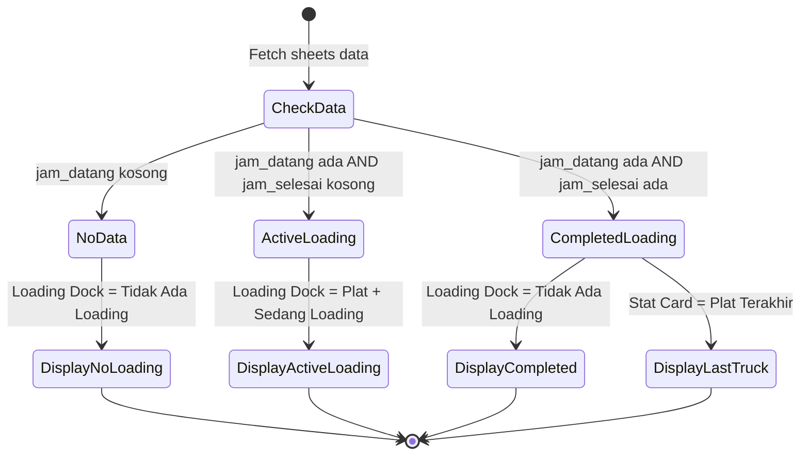
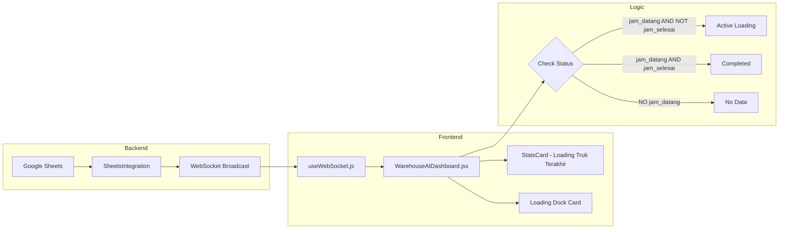

# Implementation Plan: Loading Dock Status Logic

## Business Goal

Menampilkan status loading truk secara real-time berdasarkan data Jam Datang dan Jam Selesai dari Google Sheets.

## Requirements

### Logic Rules:

1. **Truk Sedang Loading** (Active Loading):
   - Kondisi: `jam_datang` ada/terisi DAN `jam_selesai` kosong/tidak ada
   - Tampilkan: Plat truk di **Loading Dock card** (card besar di sidebar kanan)
   - Status: "Sedang Loading"

2. **Truk Selesai Loading** (Completed):
   - Kondisi: `jam_datang` ada DAN `jam_selesai` ada (keduanya terisi)
   - Tampilkan: Plat truk di **stat card "Loading Truk Terakhir"** (card ke-5 di stats row)
   - Loading Dock card: Tampilkan "Tidak Ada Loading"

3. **Tidak Ada Data**:
   - Kondisi: Tidak ada data atau `jam_datang` kosong
   - Tampilkan: "Tidak Ada Loading" di Loading Dock card
   - Stat card: "N/A" atau placeholder

---

## Current State Analysis

### Data Flow (Existing):

```
Google Sheets → WebApp/gspread → Backend (google_sheets.py)
    → WebSocket (sheets_update) → Frontend (useWebSocket.js)
    → WarehouseAIDashboard.jsx → UI
```

### Backend Already Has:

- [`SheetsData`](../gui_version_testing_with_server/src/unified_server/integrations/google_sheets.py:22-50) dataclass sudah memiliki:
  - `jam_datang: str`
  - `jam_selesai: str`
  - `latest_plate: str`

### Frontend Current State:

- [`useWebSocket.js`](../dashboard/src/hooks/useWebSocket.js:18-26) - `sheetsData` state BELUM include `jam_datang` dan `jam_selesai`
- [`WarehouseAIDashboard.jsx`](../dashboard/src/components/WarehouseAIDashboard.jsx:143-161) - Loading Dock card hardcoded "Tidak Ada Loading"

---

## Implementation Design

### Mermaid: State Diagram



### Mermaid: Component Data Flow



---

## Changes Required

### 1. Frontend: useWebSocket.js

**File:** `dashboard/src/hooks/useWebSocket.js`

**Change:** Tambahkan `jam_datang` dan `jam_selesai` ke initial state `sheetsData`

```javascript
// BEFORE (line 18-26)
const [sheetsData, setSheetsData] = useState({
  latest_plate: "N/A",
  latest_driver: "Unknown",
  latest_items: "Unknown",
  loading_count: 0,
  rehab_count: 0,
  latest_loading: 0,
  latest_rehab: 0,
});

// AFTER
const [sheetsData, setSheetsData] = useState({
  latest_plate: "N/A",
  latest_driver: "Unknown",
  latest_items: "Unknown",
  loading_count: 0,
  rehab_count: 0,
  latest_loading: 0,
  latest_rehab: 0,
  jam_datang: "", // NEW
  jam_selesai: "", // NEW
});
```

---

### 2. Frontend: WarehouseAIDashboard.jsx

**File:** `dashboard/src/components/WarehouseAIDashboard.jsx`

#### 2a. Add Helper Function for Loading Status

```javascript
// Add after line 48 (after parseValue function)

/**
 * Determine loading status based on jam_datang and jam_selesai
 * @returns {{ isActiveLoading: boolean, isCompleted: boolean, activePlate: string, lastCompletedPlate: string }}
 */
const getLoadingStatus = () => {
  const jamDatang = sheetsData.jam_datang?.trim() || "";
  const jamSelesai = sheetsData.jam_selesai?.trim() || "";
  const plate = sheetsData.latest_plate || "N/A";

  // Case 1: Has arrival time but no completion time = Currently Loading
  if (jamDatang && !jamSelesai) {
    return {
      isActiveLoading: true,
      isCompleted: false,
      activePlate: plate,
      lastCompletedPlate: "N/A",
    };
  }

  // Case 2: Has both arrival and completion time = Completed
  if (jamDatang && jamSelesai) {
    return {
      isActiveLoading: false,
      isCompleted: true,
      activePlate: null,
      lastCompletedPlate: plate,
    };
  }

  // Case 3: No data
  return {
    isActiveLoading: false,
    isCompleted: false,
    activePlate: null,
    lastCompletedPlate: "N/A",
  };
};

const loadingStatus = getLoadingStatus();
```

#### 2b. Update Stats Card Config (Loading Truk Terakhir)

```javascript
// BEFORE (line 102-110)
{
  icon: Box,
  label: 'Loading Truk Terakhir',
  value: activeLoadingTruck.plate,
  badge: sheetsData.latest_plate !== 'N/A' && sheetsData.latest_plate
    ? `Loading: ${barangMasuk} | Rehab: ${barangKeluar}`
    : 'Tidak Ada Data',
  // ...
}

// AFTER
{
  icon: Box,
  label: 'Loading Truk Terakhir',
  value: loadingStatus.lastCompletedPlate,  // Show last COMPLETED truck
  badge: loadingStatus.isCompleted
    ? `Loading: ${barangMasuk} | Rehab: ${barangKeluar}`
    : 'Tidak Ada Data',
  // ...
}
```

#### 2c. Update Loading Dock Card (Big Card in Sidebar)

```javascript
// BEFORE (line 143-161) - Hardcoded "Tidak Ada Loading"
<div className="bg-violet-100/50 ...">
  ...
  <h3 className="text-2xl font-black text-violet-900 mb-2">Tidak Ada Loading</h3>
  <p className="text-sm font-medium text-violet-700">
    Semua dock tersedia
  </p>
</div>

// AFTER - Dynamic based on loadingStatus
<div className={`${loadingStatus.isActiveLoading ? 'bg-amber-100/50 border-amber-100' : 'bg-violet-100/50 border-violet-100'} ...`}>
  ...
  {loadingStatus.isActiveLoading ? (
    <>
      <h3 className="text-2xl font-black text-amber-900 mb-2">
        {loadingStatus.activePlate}
      </h3>
      <p className="text-sm font-medium text-amber-700">
        Sedang Loading • {sheetsData.jam_datang}
      </p>
    </>
  ) : (
    <>
      <h3 className="text-2xl font-black text-violet-900 mb-2">
        Tidak Ada Loading
      </h3>
      <p className="text-sm font-medium text-violet-700">
        Semua dock tersedia
      </p>
    </>
  )}
</div>
```

---

## UI States Summary

| State              | Loading Dock Card                                     | Stat Card Loading Truk Terakhir          |
| ------------------ | ----------------------------------------------------- | ---------------------------------------- |
| **Active Loading** | 🟡 Amber bg, Plat Number, "Sedang Loading • 13:50:59" | Plat sebelumnya yang completed, atau N/A |
| **Completed**      | 🟣 Violet bg, "Tidak Ada Loading"                     | ✅ Plat yang baru selesai                |
| **No Data**        | 🟣 Violet bg, "Tidak Ada Loading"                     | N/A                                      |

---

## Data Contract

### Backend → Frontend (sheets_update event)

```typescript
interface SheetsData {
  latest_plate: string; // e.g., "KT 9900 PQ HINO"
  latest_driver: string;
  latest_items: string;
  loading_count: number;
  rehab_count: number;
  latest_loading: number;
  latest_rehab: number;
  jam_datang: string; // e.g., "13:50:59" or ""
  jam_selesai: string; // e.g., "15:15:36" or ""
  total_records: number;
  last_update: number;
}
```

---

## Risk Assessment

| Risk                                          | Impact               | Mitigation                                         |
| --------------------------------------------- | -------------------- | -------------------------------------------------- |
| Backend tidak mengirim jam_datang/jam_selesai | UI tidak update      | Backend sudah support, verify dengan console.log   |
| Data kosong/null                              | Crash atau undefined | Helper function dengan fallback values             |
| Multiple trucks loading simultaneously        | Hanya tampil 1       | Design limitation - future: array of active trucks |

---

## Testing Checklist

- [ ] Active loading state: Truck with jam_datang but no jam_selesai
- [ ] Completed state: Truck with both jam_datang and jam_selesai
- [ ] No data state: Empty sheets or no jam_datang
- [ ] Transition: Active → Completed (when jam_selesai is added)
- [ ] Console.log verify sheetsData includes jam_datang/jam_selesai

---

## Files to Modify

1. **`dashboard/src/hooks/useWebSocket.js`** - Add jam_datang, jam_selesai to initial state
2. **`dashboard/src/components/WarehouseAIDashboard.jsx`** - Add logic and update UI

**No backend changes needed** - data already available in SheetsData.

---

## Implementation Order

1. Update `useWebSocket.js` - add fields to state
2. Update `WarehouseAIDashboard.jsx` - add helper function
3. Update `WarehouseAIDashboard.jsx` - modify Stats Card config
4. Update `WarehouseAIDashboard.jsx` - modify Loading Dock Card
5. Test all states
6. Update UI_CHANGELOG.md
