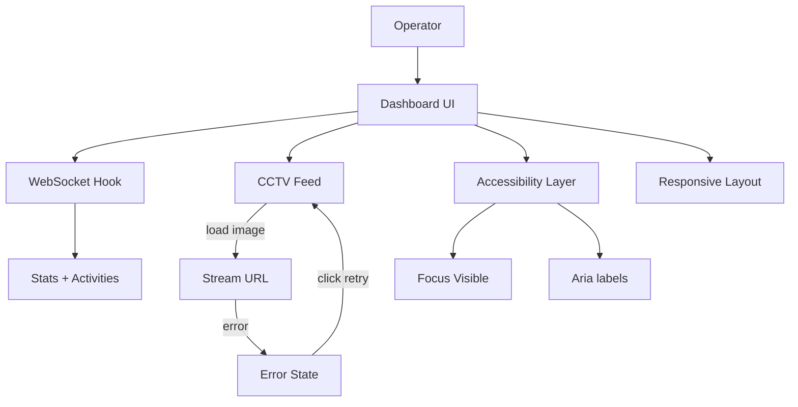

# Phase 1 Implementation Design — Gudang AI Monitor Dashboard

> **Scope:** Accessibility + Critical Fixes (P0) from [dashboard/UX_UI_ANALYSIS_REPORT.md](dashboard/UX_UI_ANALYSIS_REPORT.md:1)
> **Audience:** Architect + Implementer (FE/BE/QA)
> **Language:** Bilingual (ID/EN)

---

## 1. Ringkasan Tujuan / Goal Summary

**ID:** Menghilangkan hambatan aksesibilitas dan masalah kritikal UI agar dashboard dapat dipakai dengan aman oleh operator gudang, termasuk pemulihan error stream dan responsivitas CCTV.

**EN:** Remove accessibility blockers and critical UI issues so the dashboard is safely operable by warehouse staff, including stream error recovery and responsive CCTV layout.

**Phase 1 Outcomes (P0):**

- Keyboard operable & focus visible pada seluruh kontrol utama.
- Diferensiasi inbound/outbound tidak hanya bergantung pada warna.
- UI pemulihan error stream dengan aksi retry.
- CCTV container responsif.
- Debug log dihapus dari production.

---

## 2. Scope & Non‑Goals

**In scope (P0):**

- Fokus keyboard & ARIA label untuk kontrol interaktif di [dashboard/src/components/CCTVFeed.jsx](dashboard/src/components/CCTVFeed.jsx:1) dan [dashboard/src/components/StatsCard.jsx](dashboard/src/components/StatsCard.jsx:1)
- Perbaikan error state CCTV + tombol retry
- Responsif CCTV container (hapus `w-[960px]` fixed)
- Label/ikon tambahan untuk inbound/outbound di [dashboard/src/components/ActivityLog.jsx](dashboard/src/components/ActivityLog.jsx:1) & stats cards
- Hapus `console.log` debug di [dashboard/src/components/WarehouseAIDashboard.jsx](dashboard/src/components/WarehouseAIDashboard.jsx:1)

**Out of scope (Phase 1):**

- Filter Activity Log, toast, pagination, i18n
- Design token system (Phase 3)
- Kamera 2–4 real stream implementation (Phase 2+)

---

## 3. System Flow (Mermaid)

**ID:** Fokus Phase 1 berada pada lapisan UI, bukan pada sumber data. Error stream ditangani dengan state lokal di CCTV dan tombol retry.

**EN:** Phase 1 focuses on the UI layer, not data sources. Stream errors are handled locally in CCTV with a retry action.

---

## 4. Functional Design (Phase 1)

### 4.1 Aksesibilitas & Fokus Keyboard

**ID:** Semua tombol (kamera, fullscreen, filter, view all) harus memiliki fokus jelas dan dapat dioperasikan via keyboard. Tambahkan `aria-label` untuk tombol ikon.
**EN:** All buttons (camera, fullscreen, filter, view all) must have visible focus and keyboard operability. Add `aria-label` for icon buttons.

**Target Components:**

- [dashboard/src/components/CCTVFeed.jsx](dashboard/src/components/CCTVFeed.jsx:1)
- [dashboard/src/components/WarehouseAIDashboard.jsx](dashboard/src/components/WarehouseAIDashboard.jsx:1)
- [dashboard/src/components/ActivityLog.jsx](dashboard/src/components/ActivityLog.jsx:1)

### 4.2 Diferensiasi Inbound/Outbound

**ID:** Tambahkan label teks atau ikon kontekstual agar inbound/outbound tidak hanya dibedakan warna. Hindari tailwind class dinamis untuk menghindari purge.
**EN:** Add text labels or contextual icons so inbound/outbound is not color-only. Avoid dynamic Tailwind classes to prevent purge.

**Target Component:**

- [dashboard/src/components/ActivityLog.jsx](dashboard/src/components/ActivityLog.jsx:1)
- [dashboard/src/components/StatsCard.jsx](dashboard/src/components/StatsCard.jsx:1)

### 4.3 Error Recovery di CCTV

**ID:** Saat stream gagal, tampilkan pesan dengan tindakan retry (refresh stream URL). Pastikan tombol retry fokusable.
**EN:** On stream failure, show message with retry action (refresh stream URL). Ensure retry button is focusable.

**Target Component:**

- [dashboard/src/components/CCTVFeed.jsx](dashboard/src/components/CCTVFeed.jsx:1)

### 4.4 Responsif CCTV Container

**ID:** Ganti `w-[960px]` menjadi `max-w-[960px] w-full` agar adaptif di mobile.
**EN:** Replace `w-[960px]` with `max-w-[960px] w-full` for mobile responsiveness.

**Target Component:**

- [dashboard/src/components/CCTVFeed.jsx](dashboard/src/components/CCTVFeed.jsx:1)

### 4.5 Hapus Debug Log

**ID:** Hapus `console.log` untuk mencegah noisy logs dan menjaga performa.
**EN:** Remove `console.log` to avoid noisy logs and preserve performance.

**Target Component:**

- [dashboard/src/components/WarehouseAIDashboard.jsx](dashboard/src/components/WarehouseAIDashboard.jsx:1)

---

## 5. Code Structure (Phase 1)

### 5.1 File‑level Responsibilities

- **CCTV Feed**: UI stream, error state, retry action, focus states
  - [dashboard/src/components/CCTVFeed.jsx](dashboard/src/components/CCTVFeed.jsx:1)

- **Stats Cards**: A11y label, non‑color differentiation, consistent label text
  - [dashboard/src/components/StatsCard.jsx](dashboard/src/components/StatsCard.jsx:1)

- **Activity Log**: Avoid dynamic Tailwind classes, add explicit classes and text markers
  - [dashboard/src/components/ActivityLog.jsx](dashboard/src/components/ActivityLog.jsx:1)

- **Dashboard Layout**: Remove debug logs, ensure key buttons have a11y labels
  - [dashboard/src/components/WarehouseAIDashboard.jsx](dashboard/src/components/WarehouseAIDashboard.jsx:1)

- **WebSocket**: No change in Phase 1 (only UI adjustments)
  - [dashboard/src/hooks/useWebSocket.js](dashboard/src/hooks/useWebSocket.js:1)

### 5.2 Minimal Structural Additions (Optional)

**ID:** Jika dibutuhkan, buat util kecil untuk class map inbound/outbound agar tidak pakai class string dinamis.
**EN:** If needed, add a small util to map inbound/outbound classes to avoid dynamic Tailwind classes.

Proposed helper:

- `dashboard/src/utils/activityStyles.js` (optional)

---

## 6. Acceptance Criteria (Phase 1)

**ID:**

- Semua tombol dapat di-tab dengan fokus terlihat.
- Inbound/outbound dapat dibedakan tanpa warna (ada ikon/label eksplisit).
- Error stream menampilkan tombol retry dan berfungsi.
- CCTV container tidak overflow di mobile.
- Tidak ada debug logs di console.

**EN:**

- All buttons are tab-accessible with visible focus.
- Inbound/outbound differentiable without color (explicit label/icon).
- Stream error shows retry button and works.
- CCTV container does not overflow on mobile.
- No debug logs in console.

---

## 7. Implementation Steps (High‑level)

1. Update CCTV feed markup and error UI in [dashboard/src/components/CCTVFeed.jsx](dashboard/src/components/CCTVFeed.jsx:1)
2. Add focus styles and aria labels in key buttons within [dashboard/src/components/WarehouseAIDashboard.jsx](dashboard/src/components/WarehouseAIDashboard.jsx:1)
3. Replace dynamic Tailwind classes in [dashboard/src/components/ActivityLog.jsx](dashboard/src/components/ActivityLog.jsx:1) with explicit class maps
4. Update StatsCard to include non‑color differentiation elements in [dashboard/src/components/StatsCard.jsx](dashboard/src/components/StatsCard.jsx:1)
5. Remove debug console logs in [dashboard/src/components/WarehouseAIDashboard.jsx](dashboard/src/components/WarehouseAIDashboard.jsx:1)

---

## 8. Risks & Mitigations

**ID:**

- Risiko: Tailwind purge menghapus class dinamis. Mitigasi: ganti ke class map statis.
- Risiko: Retry stream gagal karena URL tidak berubah. Mitigasi: reset state dan reassign stream URL di handler retry.

**EN:**

- Risk: Tailwind purge drops dynamic classes. Mitigation: static class map.
- Risk: Retry stream fails if URL unchanged. Mitigation: reset state and reassign stream URL in retry handler.

---

## 9. Definition of Done (Phase 1)

**ID:** Seluruh acceptance criteria terpenuhi dan lulus QA aksesibilitas dasar.
**EN:** All acceptance criteria met and passes basic accessibility QA.
